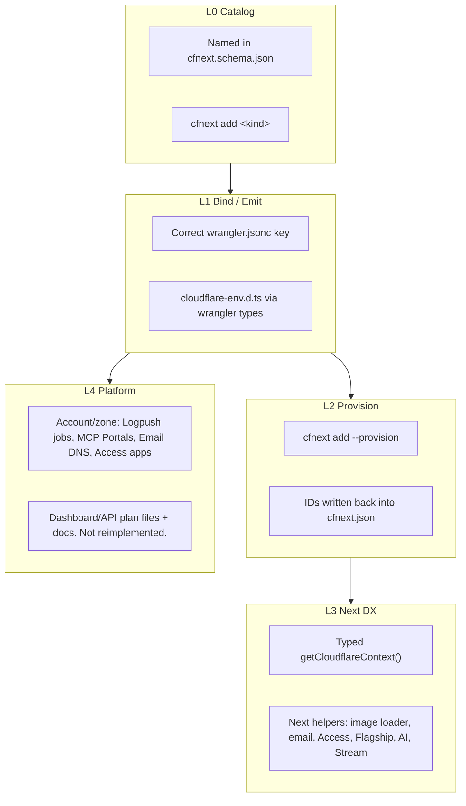
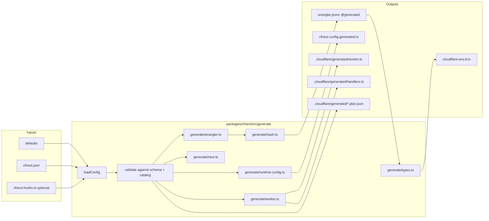
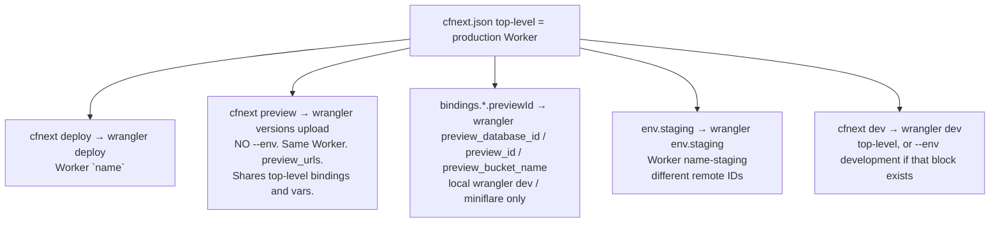

# cfnext Platform Catalog and `cfnext.json` Compiler

| Field | Value |
| --- | --- |
| **Title** | cfnext as the default way to ship Next.js on Cloudflare |
| **Author** | cfnext maintainers |
| **Date** | 2026-08-16 |
| **Status** | Draft |
| **Audience** | Senior engineers on `packages/cfnext` |
| **Repo** | `/home/awfixer/Projects/websites/cfnext` |
| **Scope** | Product roadmap + `cfnext.json` compiler design. Not implementation. |

---

## Overview

cfnext is a Bun-first Next.js 16.2 adapter and CLI for Cloudflare. It is **not OpenNext**. It implements the official Next.js Adapter API and deploys to three targets (`workers`, `ssr`, `container`) via **Workers + Assets**, never Pages.

Today the product surface is a thin slice of the Cloudflare developer platform: seven loosely typed bindings, Clerk-style `protect` prefixes, default security headers, and a CLI that mutates `wrangler.jsonc` directly. Config lives in `cfnext.config.ts`. Wrangler lives in `wrangler.jsonc`. Those two files already drift. Types are a thin wrap of `wrangler types`. `getCloudflareContext().env` is `unknown`. There is no product catalog, no `cfnext.json`, and no Next-shaped helpers that compete with Vercel Image Optimization, Deployment Protection, Flags, Workflows, or the AI SDK.

This document picks one shippable design: **`cfnext.json` (JSONC allowed) is the product catalog and codegen source of truth.** `cfnext add` mutates `cfnext.json`. A compiler (`cfnext generate`, implicit on `build` / `deploy` / `preview` / `dev` / `types` **only when `cfnext.json` exists**) emits:

1. `wrangler.jsonc` — generated from the catalog via `catalog.emit` allow-lists, marked `@generated`, refused if the raw post-header bytes are dirty
2. **`cfnext.config.generated.ts`** — runtime config the Worker imports (`name`, `target`, `protect`, `securityHeaders`, `images`). Always overwritten. Never authored.
3. `cloudflare-env.d.ts` — via `wrangler types --env-interface CloudflareEnv`
4. `.cloudflare/generated/worker.ts` (P1+) — Wrangler `main`; composes user `worker.ts` + handler barrel. User `worker.ts` is never overwritten
5. `.cloudflare/generated/handlers.ts` — barrel of user-owned email / queue / cron / workflow / DO stubs
6. Next adapter hooks — URL-based `next/image` loader (not `env.IMAGES`), public/private env split, Access on preview URLs

**One authored file generates the other.** JSON is authored. Generate produces the runtime module. Optional **`cfnext.hooks.ts`** exists only for TypeScript that JSON cannot express (Clerk `clerkShells()`, custom protect functions). Init does **not** write a hand-authored `cfnext.config.ts`. `worker.ts` imports `./cfnext.config.generated`, never a hand-written config.

Durable Object `migrations` are a **committed append-only log in `cfnext.json`**, copied to wrangler, never recomputed from the live class set.

Vercel Preview is **`wrangler versions upload` on the production Worker** (`preview_urls`). Those versions **share the top-level Worker’s bindings and vars**. Wrangler’s `previews { }` block is for `wrangler preview`, **not** `versions upload` (vendored `cli.d.ts`: “used when creating Preview deployments via `wrangler preview`”). cfnext does **not** emit `previews { }` and does **not** switch the CLI to `wrangler preview`. Long-lived different IDs = named Worker `env.staging` → `name-staging`. Local/miniflare alternate IDs = top-level `previewId` → `preview_database_id` / `preview_id` / `preview_bucket_name`. There is no `env.preview` / `env.production` named env.

The competitive goal is **DX parity with Vercel, not cloning Vercel APIs**. Every relevant Cloudflare product is classified L0–L4 and phased with an exit criterion: what the user types, and what files appear. Schema-valid fields whose `emit` is not in this package version are a **hard generate error**, not a silent drop.

---

## Background & Motivation

### Current state (verified in tree)

| Concern | Today | File |
| --- | --- | --- |
| User config | `CfnextConfig` / `CfnextUserConfig`: `name`, `target`, `protect`, `images.unoptimized`, `securityHeaders` | [`packages/cfnext/src/config.ts`](packages/cfnext/src/config.ts) |
| Config files loaded | `cfnext.config.ts\|mjs\|js` only | `CONFIG_FILES` in `config.ts` |
| Wrangler emit | `buildWrangler()` writes assets, observability, optional `nodejs_compat`, container DO | [`packages/cfnext/src/wrangler.ts`](packages/cfnext/src/wrangler.ts) |
| Binding kinds | `d1 \| r2 \| kv \| hyperdrive \| ai \| vectorize \| queue` | [`packages/cfnext/src/bindings.ts`](packages/cfnext/src/bindings.ts) |
| Binding types | `Array<Record<string, unknown>>` | `WranglerConfig` in `wrangler.ts` |
| `cfnext add` | Mutates `wrangler.jsonc` via `applyBinding()` + `mergeWrangler()` | [`packages/cfnext/src/cli/commands/add.ts`](packages/cfnext/src/cli/commands/add.ts) |
| Provision | Shells out to `wrangler <kind> create`; IDs left as `"replace-after-wrangler-*-create"` | `provisionCommand()` in `bindings.ts` |
| Types | `wrangler types --env-interface CloudflareEnv cloudflare-env.d.ts` | [`packages/cfnext/src/cli/commands/types.ts`](packages/cfnext/src/cli/commands/types.ts) |
| Init | Scaffolds `cfnext.config.ts` + `wrangler.jsonc` + `worker.ts` + stub `cloudflare-env.d.ts` | [`packages/cfnext/src/templates/app.ts`](packages/cfnext/src/templates/app.ts) |
| Project root | `cfnext.config.ts` **or** `wrangler.jsonc` | [`packages/cfnext/src/cli/find-root.ts`](packages/cfnext/src/cli/find-root.ts) |
| SSR context | `env: unknown` | [`packages/cfnext/src/ssr/context.ts`](packages/cfnext/src/ssr/context.ts) |
| Secrets | Non-`NEXT_PUBLIC_*` `.env.local` → `.cloudflare/secrets.json` → `wrangler secret bulk` | [`packages/cfnext/src/cli/commands/env.ts`](packages/cfnext/src/cli/commands/env.ts) |
| Next wrapper | `withCfnext()` only injects `adapterPath` | [`packages/cfnext/src/with-cfnext.ts`](packages/cfnext/src/with-cfnext.ts) |
| Images | `images.unoptimized: true` on workers/ssr; container leaves Next optimizer on | `normalizeConfig()` + `adapter.modifyConfig()` |
| Observability | Hard-coded `enabled: true`, `head_sampling_rate: 1` | `buildWrangler()` |
| Durable Objects | Only the reserved container pair `NEXT_APP` / `NextApp` | `buildWrangler()` when `target === "container"` |
| Queue | Producer only. No consumer, no `queue()` handler | `applyBinding()` `case "queue"` |
| Worker handlers | `fetch` only (`createAssetsWorker` / `createSsrWorker` / `createContainerWorker`) | [`packages/cfnext/src/worker/`](packages/cfnext/src/worker/) |
| CLI surface | `init`, `add`, `build`, `deploy`, `preview`, `dev`, `env`, `types` | [`packages/cfnext/src/cli/index.ts`](packages/cfnext/src/cli/index.ts) |
| Generate command | Does not exist | — |
| `cfnext.json` | Does not exist | — |

Wrangler 4 already understands far more than cfnext emits. Vendored `packages/cfnext/node_modules/wrangler/config-schema.json` includes `access`, `agent_memory`, `ai`, `ai_search`, `ai_search_namespaces`, `analytics_engine_datasets`, `browser`, `containers`, `d1_databases`, `durable_objects`, `flagship`, `hyperdrive`, `images`, `kv_namespaces`, `logpush`, `media`, `observability`, `pipelines`, `queues`, `r2_buckets`, `secrets`, `secrets_store_secrets`, `send_email`, `stream`, `triggers`, `vectorize`, `workflows`, `vars`, `env`, plus `passthrough` candidates (`worker_loaders`, `vpc_*`, `websearch`, `artifacts`).

cfnext currently types **seven** of those keys, and only as `Record<string, unknown>`.

### Pain points

1. **Two sources of truth.** `cfnext.config.ts` owns target/protect; `wrangler.jsonc` owns bindings. `cfnext add` writes wrangler; a human edits wrangler; `buildWrangler()` is only used when the file is missing (`ensureWrangler` no-ops if present). Drift is the default.
2. **Vercel-shaped gaps.** A Next app on Vercel gets preview protection, flags, image optimization, cron, workflows, KV/Postgres/Blob, AI SDK, analytics, and env environments as first-class. A Next app on cfnext gets seven binding snippets and a cookie-prefix gate.
3. **Placeholders rot.** `"replace-after-wrangler-d1-create"` is committed, never written back, and is not a valid D1 UUID.
4. **Types are not a product.** `getCloudflareContext().env` is `unknown`. The health route in the SSR template already has to `Boolean(getCloudflareContext().env)` inside try/catch.
5. **Worker is fetch-only.** Email Routing, Queue consumers, cron, and Workflows require `email` / `queue` / `scheduled` / exported classes. There is no composition API and no stub generator.
6. **Container DO collides with the future.** `buildWrangler()` stomps `durable_objects` with `{ NEXT_APP, NextApp }`. User DOs cannot be merged today.
7. **Pages confusion.** Cloudflare is steering Pages → Workers + Assets. cfnext already deploys via Workers. We must not grow a Pages target, but we do owe a migration story.

### Why now

Wrangler 4 (peer `>= 4.0.0`, scaffolded at `^4.123.0`) has the binding surface. Next 16.2 has a stable Adapter API. Cloudflare Access can protect `workers.dev` and preview URLs; Flagship has a native binding + `@cloudflare/flagship`; Email Service unifies sending (`env.EMAIL.send`) and routing (`email()`); `secrets.required` feeds typegen and deploy validation. The missing piece is a **Next-shaped catalog compiler**, not another Cloudflare API client.

---

## Goals & Non-Goals

### Goals

- Make `cfnext.json` the product catalog and codegen source of truth.
- Map every listed Cloudflare developer-platform product into cfnext at a declared integration level (L0–L4), with a phase and an exit criterion.
- Emit **real** Wrangler keys. Do not invent a parallel Cloudflare API.
- Give Next developers Vercel-grade DX: `cfnext add`, typed `getCloudflareContext()`, preview protection, flags, images, email, AI, multi-env.
- Keep an **optional** `cfnext.hooks.ts` only for TypeScript that JSON cannot express. Generate always emits `cfnext.config.generated.ts` for the Worker.
- Make generated `wrangler.jsonc` safe: marked generated, hash-checked, refused if dirty.
- Support Vercel-like Production / Preview / Development **without** mapping Preview onto a Wrangler named env: top-level Worker = production, `cfnext preview` = `versions upload`, `env.staging` (etc.) = separate named Workers.
- Type `getCloudflareContext().env` as `CloudflareEnv`, not `unknown`.
- Remain Bun-first, official Adapter API, three deploy targets.

### Non-Goals

- **Pages as a deploy target.** Document Pages as a migration/compat story only. `cfnext migrate pages` is post-P0.
- **Cloning Vercel APIs.** No `@vercel/kv` shim, no `vercel.json` clone, no Fluid Compute emulation. Map products onto Cloudflare primitives.
- **Reimplementing account/zone products.** Logpush jobs, MCP Portals, Email Routing DNS, Access apps, WAF, Turnstile: scaffold + document + optional provision. Do not rebuild the dashboard.
- **OpenNext compatibility.** Not a goal. Do not absorb OpenNext config.
- **A fourth runtime.** No Deno, no bare Pages Functions, no Python Workers.
- **Generating malware, exploits, or attack tooling.**
- **Overbuilding Sandbox.** Mention Containers / Sandbox as the Vercel Sandbox analog. Do not ship a sandbox product in P0–P5.
- **A separate resource lockfile in P0.** Resource IDs live in `cfnext.json` (committed). Revisit a lockfile only if ID write-back becomes noisy.

---

## Current-State Gap Analysis

Status key:

- **exists** — shipped and used in the happy path
- **stubbed** — type, default, or partial emit only
- **missing** — not in schema, CLI, or runtime

| Product | Status | What exists | Gap |
| --- | --- | --- | --- |
| Workers (target) | **exists** | `target: "workers"`, `createAssetsWorker`, Assets + Fetch | No catalog. No `cfnext.json` target field. |
| Pages | **missing** (intentionally not a target) | Nothing | Migration guide + later `cfnext migrate pages` |
| SSR (target) | **exists** | `createSsrWorker`, `nodejs_compat`, `getCloudflareContext()` | `env: unknown`; no extra handlers |
| Containers (target) | **exists** | `containers` + reserved DO `NEXT_APP`/`NextApp` | No merge with user DOs; no catalog |
| D1 | **exists** (L1 + partial L2) | `cfnext add d1`, placeholder `database_id`, `migrations/` | No ID write-back; untyped; no helper |
| R2 | **exists** (L1 + partial L2) | `cfnext add r2 --provision` | No Next upload helper (Vercel Blob analog) |
| KV | **exists** (L1 + partial L2) | `cfnext add kv`, placeholder `id` | No ID write-back; no session/flag helper |
| Hyperdrive | **exists** (L1 + partial L2) | Binding + create command needing `$DATABASE_URL` | `id` required; no write-back; no connection helper |
| Workers AI | **exists** (L1 only) | `wrangler.ai = { binding }` | No models catalog, no AI Gateway, no `cfnext/ai` |
| Vectorize | **exists** (L1 + partial L2) | Binding + create `--dimensions 768 --metric cosine` | Hard-coded dims; no query helper |
| Queues | **stubbed** | Producer only | No consumer, no `queue()` handler, no DLQ |
| Durable Objects | **stubbed** | Container `NextApp` only | User classes, migrations merge, collision rules |
| Workflows | **missing** | — | Binding + class stub + cron schedules |
| Access | **missing** | Cookie-prefix `protect` only | Preview/production Access, `ctx.access`, local `access.dev` |
| Flagship | **missing** | — | Binding + OpenFeature helper |
| Observability | **stubbed** | `enabled: true`, `head_sampling_rate: 1` | traces/logs split, destinations, sampling per env |
| Logpush | **missing** | — | `logpush: true` + L4 job plan |
| Email Sending | **missing** | — | `send_email` + `env.EMAIL.send` helper |
| Email Routing | **missing** | — | `email()` handler + L4 DNS/routing |
| Images | **stubbed** | `images.unoptimized` only | Images binding + `next/image` loader |
| Stream | **missing** | — | `stream` binding + player helper |
| Media transforms | **missing** | — | `media` binding |
| Realtime | **missing** | — | L4 SDK/docs (no wrangler key today) |
| Models | **missing** | — | Named model aliases in `ai.models` |
| AI Gateway | **missing** | — | `ai.gateway` → vars + client |
| AI Search | **missing** | — | `ai_search` / `ai_search_namespaces` |
| Agents | **missing** | — | DO + optional `agent_memory` + workflow + stub |
| MCP Portals | **missing** | — | L4 Zero Trust / Access AI-controls, not a binding |
| Analytics Engine | **missing** | — | `analytics_engine_datasets` |
| Pipelines | **missing** | — | `pipelines` binding |
| Secrets Store | **missing** | Worker secrets via `cfnext env` only | `secrets_store_secrets` |
| `secrets.required` | **missing** | — | Typegen + deploy validation |
| vars | **missing** | — | `vars` + public/private split |
| Cron / triggers | **missing** | — | `triggers.crons` + `scheduled()` stub |
| Browser Rendering | **missing** | — | `browser` binding |
| Worker Loaders | **missing** | — | `worker_loaders` |
| Web Analytics | **missing** | — | Next `<CfnextAnalytics />` snippet |
| Version metadata | **missing** | — | `version_metadata` binding |
| Multi-env | **missing** | `preview` = `wrangler versions upload` only | Named `env.staging` Workers; preview URLs share top-level bindings; local `preview_*` ids; do **not** emit wrangler `previews { }` |
| `cfnext.json` | **missing** | — | This document |
| Compiler | **missing** | `buildWrangler()` is init-only after first write | `cfnext generate` |

---

## Integration Levels

“Mapped into cfnext” is not a slogan. Every product is classified against four levels. A product may stop at L1 or L4; the catalog must say so.



| Level | User can type | Files that appear / change |
| --- | --- | --- |
| **L0** | `cfnext add <kind>` | `cfnext.json` gains a catalog entry |
| **L1** | `cfnext generate` (or implicit) | `wrangler.jsonc` + `cloudflare-env.d.ts` |
| **L2** | `cfnext add <kind> --provision` | Resource created; `id` / `database_id` / `app_id` written back |
| **L3** | `import { … } from "cfnext/server"` or `"cfnext/email"` | Typed helper, component, or loader |
| **L4** | `cfnext add logpush --provision` (optional) | `.cloudflare/generated/<product>.plan.json` + printed dashboard/API next steps |

P0 ships the compiler and L1 emit for **the current seven bindings plus `build.command` / assets / observability defaults**. Later kinds are named in the catalog (`emitImplemented: false`) so `cfnext add` / generate **refuse** them until their emit PR. L2–L3 are phased per family. L4 never blocks L1. Do not advertise L1 for a kind P0 cannot emit.

---

## Vercel ↔ Cloudflare ↔ cfnext Competitive Mapping

DX parity, not API clones. The right-hand column is what cfnext should feel like, not a `vercel.json` translation.

| Vercel | Cloudflare primitive | cfnext mapping | Target level | Phase |
| --- | --- | --- | --- | --- |
| Next.js hosting / Fluid / Functions | Workers + Assets; Worker `handler()`; Containers | `target: workers \| ssr \| container` | L3 | P0 (exists; compiler owns it) |
| Preview deployments | `preview_urls` + `wrangler versions upload` (same Worker) | `cfnext preview` (no `--env`). Versions share top-level bindings. | L3 | P0 (CLI exists) |
| Deployment Protection | Access on preview URLs + workers.dev | `access.protectPreview` / `protectProduction` | L3 + L4 | P2 |
| Vercel Firewall / BotID | WAF + Turnstile | Document only; Access is in-scope | L4 | later |
| Vercel Env (Production / Preview / Development) | Top-level Worker + `versions upload` + optional named Workers | Top-level = production; preview URLs share it; `env.staging` / `env.development` named Workers | L3 | Named-env emit in P0; CLI `--env staging` in P6 |
| `NEXT_PUBLIC_*` | Build-time inlining | Keep in `.env.local`; never `wrangler secret` | L3 | exists |
| Vercel KV | KV | `bindings.kv` | L3 | P0 L1, P6 helper |
| Vercel Postgres / Neon / Marketplace DB | D1 + Hyperdrive | `bindings.d1`, `bindings.hyperdrive` | L3 | P0 / P1 |
| Vercel Blob | R2 | `bindings.r2` + `cfnext/blob` helper | L3 | P1 helper |
| Vercel Edge Config | Flagship + KV | `flagship` primary; KV fallback | L3 | P2 |
| Vercel Flags | Flagship (`@cloudflare/flagship` / binding) | `cfnext/flags` | L3 | P2 |
| Vercel Cron | `triggers.crons` + Workflows | `cron` + `workflows` | L3 | P1 |
| Vercel Workflows | Workflows | `workflows` + class stub | L3 | P1 |
| Vercel Queues / streaming fanout | Queues | `bindings.queues` producers + consumers | L3 | P1 |
| Vercel AI SDK / AI Gateway | Workers AI + AI Gateway + AI Search + Vectorize + Agents | `ai.*` + `cfnext/ai` | L3 | P4 |
| Vercel Marketplace models | Workers AI model catalog + Gateway | `ai.models` aliases | L3 | P4 |
| Vercel Image Optimization | Cloudflare Images binding + next/image | `media.images` + loader | L3 | P3 |
| Vercel Blob media / video | R2 + Stream + Media Transformations | `media.stream`, `media.transforms`, R2 | L3 | P3 |
| Vercel Analytics / Speed Insights | Workers Observability + Analytics Engine + Web Analytics | `observability` + `analyticsEngine` + `<CfnextAnalytics />` | L3 | P2 / P5 |
| Log drains | Logpush + OTLP destinations | `logpush` + `observability.logs.destinations` | L4 + L1 | P2 |
| Vercel Sandbox | Containers / Sandbox SDK | Mention; `target: container` | L1 | later |
| Resend / email marketplace | Email Service (Sending + Routing) | `email.sending` + `email.routing` | L3 + L4 | P3 |
| Durable / realtime state | Durable Objects + Realtime | `durableObjects` + `media.realtime` docs | L3 / L4 | P1 / P3 |
| Middleware auth gates | Worker `protect` + Access | Keep `protect` for cookie shells; Access for preview | L3 | exists / P2 |
| `vercel.json` crons/headers | wrangler + `securityHeaders` | Already in adapter/worker | L3 | exists |
| Vercel Marketplace | `cfnext add` catalog | Catalog kinds | L0 | P0 |
| MCP / agent tooling | Agents SDK + MCP Portals (Zero Trust) | `agents` L3; portals L4 | L3 / L4 | P4 |

Pages has **no Vercel analog we will chase**. Vercel does not have a deprecated sister product we must keep deploying to. Pages is a Cloudflare-only migration path.

---

## Per-Product Integration Contract

Columns: Product · Vercel analog · Level · wrangler key(s) · `cfnext.json` field · CLI · Next/runtime helper · Phase · Notes.

Every user-listed product is here. Extra rows are included only when they are required to reach Vercel DX or already exist as Wrangler keys we would otherwise silently drop.

| Product | Vercel analog | Level | wrangler key(s) | cfnext.json | CLI | Helper | Phase | Notes |
| --- | --- | --- | --- | --- | --- | --- | --- | --- |
| Workers (target) | Functions / static | L3 | `assets`, `main`, `compatibility_date`, `workers_dev`, `preview_urls` | `target: "workers"` | `init --target workers` | `createAssetsWorker` | P0 | Already the default. Compiler owns emit. **Not Pages.** |
| Pages | — | L4 | — | — | `cfnext migrate pages` (later) | — | post-P6 | Compat only. Cloudflare is steering Pages → Workers + Assets. |
| SSR (target) | Fluid / Node functions | L3 | `compatibility_flags: ["nodejs_compat"]`, `assets.run_worker_first: true` | `target: "ssr"` | `init --target ssr` | `createSsrWorker`, `getCloudflareContext()` | P0 | Official Adapter `handler()`. Bindings readable in RSC/route handlers. |
| Containers | Sandbox / long Node | L3 | `containers`, reserved `durable_objects` `NEXT_APP` | `target: "container"` | `init --target container` | `createContainerWorker` | P0 | Full `next start`. Bindings stay on the Worker, **not** inside the container process. |
| D1 | Postgres / Neon (lite) | L3 | `d1_databases` | `bindings.d1[]` | `add d1` | `env.DB`; later `cfnext/d1` | P0 L1/L2, P6 helper | Default binding `DB`. `migrations_dir: "migrations"`. ID write-back on `--provision`. |
| KV | Vercel KV / Edge Config (cache) | L3 | `kv_namespaces` | `bindings.kv[]` | `add kv` | `env.KV` | P0 | Default `KV`. `id` optional (wrangler schema requires only `binding`). |
| R2 | Blob | L3 | `r2_buckets` | `bindings.r2[]` | `add r2` | `cfnext/blob` in P6 | P0 L1, P6 helper | Default `BUCKET`. Jurisdiction optional. |
| Hyperdrive | Postgres / MySQL (existing) | L2 | `hyperdrive` | `bindings.hyperdrive[]` | `add hyperdrive` | connection string helper | P1 | **`id` is required** in wrangler. `--provision` or explicit `id`. Needs `--connection-string`. |
| Durable Objects | Durable / realtime state | L3 | `durable_objects`, `migrations` | `durableObjects[]` + **`migrations[]` append-only log** | `add do` / `rm do` / `add do --rename` | class stub | P1 | Live classes ≠ migrations. Generate copies `migrations[]` verbatim. Never drop/reorder tags. |
| Workflows | Vercel Workflows | L3 | `workflows` | `workflows[]` | `add workflow` | class stub | P1 | `{ name, binding, class_name }`. Optional `schedules`. |
| Queues | Queues / fanout | L3 | `queues.producers`, `queues.consumers` | `bindings.queues[]` | `add queue` [`--consume`] | `queue.ts` stub | P1 | Today producer only. `--consume` adds consumer + handler. |
| Cron | `vercel.json` crons | L3 | `triggers.crons` | `cron[]` | `add cron` | `scheduled.ts` stub | P1 | Added: required for Vercel Cron parity. |
| Secrets Store | Encrypted env / marketplace secrets | L2 | `secrets_store_secrets` | `secrets.store[]` | `add secret-store` | `env.NAME.get()` | P1 | `{ binding, store_id, secret_name }`. |
| Worker secrets | Vercel env (secret) | L2 | `secrets.required` | `secrets.required[]` | `env`, `add secret` | typed on `CloudflareEnv` | P1 | `cfnext env` also writes `secrets.required` from `.env.local`. |
| vars | Vercel env (plain) | L1 | `vars` | `vars` | `add var` | `env.FOO` | P1 | Never put secrets here. |
| Access | Deployment Protection | L3+L4 | `access` (dev identity only) | `access` | `add access` [`--provision`] | `getAccessIdentity()` | P2 | `--provision` calls Workers Access API. Preview on by add; production `workers.dev` opt-in. Init stays public. |
| Flagship | Flags / Edge Config | L3 | `flagship` | `flagship` | `add flagship` | `cfnext/flags` | P2 | Binding + optional OpenFeature. Default binding `FLAGS`. |
| Observability | Analytics / Speed Insights (server) | L3 | `observability` | `observability` | (defaults) | — | P2 | Defaults on. traces + logs. Per-env sampling. |
| Logpush | Log drains | L4+L1 | `logpush` (boolean) | `logpush` | `add logpush` | plan file | P2 | Boolean in wrangler. Jobs are account-level. |
| Web Analytics | Vercel Analytics | L3 | — (beacon) | `analytics.web` | `add web-analytics` | `<CfnextAnalytics />` | P2 | Added: needed for client analytics parity. Not a Worker binding. |
| Email Sending | Resend / marketplace | L3 | `send_email` | `email.sending` | `add email` | `cfnext/email` `sendEmail()` | P3 | `[{ "name": "EMAIL" }]` then `env.EMAIL.send(...)`. |
| Email Routing | Inbound email | L3+L4 | handler, not a required key | `email.routing` | `add email --inbound` | `email.ts` stub | P3 | Worker `email()` + L4 DNS/routing addresses. |
| Images binding | Byte transforms in-Worker | L1 | `images` | `media.images.binding` | `add images` | `env.IMAGES.input()` | P3 | **Not** a `next/image` loader. In-Worker stream API. |
| Image Optimization | Vercel Image Optimization | L3 | none (URL) | `media.images.loader` | `add image-loader` | `cfnext/image-loader` (`loaderFile`) | P3 | Pure URL builder (`/cdn-cgi/image/...` or `imagedelivery.net`). No `env.IMAGES`. No `/_next/image` proxy. |
| Stream | Video hosting | L3 | `stream` | `media.stream` | `add stream` | `<CfnextStream />` | P3 | Binding `STREAM`. |
| Media Transformations | On-the-fly video | L2 | `media` | `media.transforms` | `add media` | `env.MEDIA.input()` | P3 | Distinct from Stream. Often `remote: true` in dev. |
| Realtime | Realtime / PartyKit analog | L4 | none today | `media.realtime` | `add realtime` | SDK docs | P3 | No wrangler key in current schema. Catalog + docs + passthrough if a key appears. |
| Workers AI | AI SDK (Workers provider) | L3 | `ai` | `ai.binding` | `add ai` | `cfnext/ai` | P4 (L1 exists) | Default binding `AI`. |
| Models | Marketplace model picker | L3 | none (aliases) | `ai.models` | `add model` | `.cloudflare/generated/models.ts` + `cfnext/ai` | P4 | TS module only. **Not** Worker `vars`. Client share requires `public: true`. |
| AI Gateway | Vercel AI Gateway | L3 | none (URL) | `ai.gateway` | `add ai-gateway` | `getAiGateway()` | P4 | Default gateway id `default`. Emit `vars.AI_GATEWAY_ID`. BYOK via Secrets Store. |
| AI Search | Vector+keyword search | L3 | `ai_search`, `ai_search_namespaces` | `ai.search` | `add ai-search` | `env.AI_SEARCH` | P4 | Instance and/or namespace bindings. |
| Vectorize | Embeddings index | L2 | `vectorize` | `ai.vectorize` **and** `bindings.vectorize` (alias) | `add vectorize` | query helper | P4 (L1 exists) | Keep `cfnext add vectorize` working. Canonical field: `bindings.vectorize`. |
| Agents | AI agents / workflows | L3 | `durable_objects` + optional `agent_memory` + `workflows` | `agents[]` | `add agent` | Agents SDK stub | P4 | Not a single wrangler key. Compiler expands to DO + memory + workflow. |
| MCP Portals | — (enterprise agent access) | L4 | none | `ai.mcpPortals` | `add mcp-portal` | docs + Access notes | P4 | Zero Trust / Access AI-controls. Account/zone. **Not a Worker binding.** |
| Analytics Engine | Custom events | L2 | `analytics_engine_datasets` | `analytics.engine[]` | `add analytics-engine` | `writeDataPoint` helper | P5 | |
| Pipelines | Streaming ETL | L2 | `pipelines` | `bindings.pipelines[]` | `add pipeline` | `env.PIPELINE` | P5 | |
| Browser Rendering | Screenshot / crawl | L2 | `browser` | `bindings.browser` | `add browser` | `env.BROWSER` | P5 | Added: wrangler key exists; useful for OG images. |
| Worker Loaders | Dynamic workers | L1 | `worker_loaders` | `bindings.workerLoaders[]` | `add worker-loader` | — | P5 | Niche. Catalog so we do not invent `unsafe`. |
| Version metadata | Deployment id | L1 | `version_metadata` | `bindings.versionMetadata` | (default **on** for `ssr` and `container`) | `env.CF_VERSION_METADATA` | P1 | Same default on both dynamic targets. Binding name `CF_VERSION_METADATA`. |
| Web Search | — | L1 | `websearch` | `ai.websearch` | `add websearch` | `env.WEBSEARCH` | P4 | Zero-config shared corpus. Optional. |
| Service bindings | Monorepo functions | L1 | `services` | `bindings.services[]` | `add service` | — | P5 | Worker-to-worker. Not a Vercel clone of “related projects”. |
| Artifacts | — | L1 | `artifacts` | `passthrough` first | — | — | later | Git-compatible storage. Out of Vercel mapping. Do not block P0. |
| VPC | — | L1 | `vpc_services`, `vpc_networks` | `passthrough` | — | — | later | Enterprise. Passthrough until a customer asks. |
| Turnstile / WAF | BotID / Firewall | L4 | — | — | — | docs | later | Access is in-scope; WAF is not a compiler feature. |
| Sandbox SDK | Vercel Sandbox | L4 | containers | mention in docs | — | — | later | Do not overbuild. |

`vectorize` appears twice in user language (standalone + under AI). One catalog kind: `vectorize`. JSON may nest under `ai.vectorize` as syntactic sugar that the compiler flattens into `bindings.vectorize`.

---

## Proposed Design

### Decision: one compiler, two user files, one generated wrangler

```
cfnext.json                    authored product catalog + migrations (SoT)
cfnext.hooks.ts                optional authored TS hooks (Clerk shells, custom protect)
cfnext.config.generated.ts     generated runtime module — Worker imports this
wrangler.jsonc                 generated artifact — do not edit
cloudflare-env.d.ts            generated by wrangler types — do not edit
.cloudflare/generated/worker.ts    generated Wrangler `main` (P1+)
.cloudflare/generated/handlers.ts  generated barrel
.cloudflare/generated/*.plan.json  L4 plans
email.ts, queue.ts, …          user-owned stubs — created once by `add`, never overwritten
worker.ts                      user-owned fetch (+ `export class NextApp` on container)
                               import config from "./cfnext.config.generated"
```

**Why `cfnext.config.generated.ts` at the project root, not `.cloudflare/generated/cfnext.config.ts`:** `.cloudflare/` is gitignored. wrangler.jsonc is already a committed generated file at the root. The Worker must resolve the runtime config on a clean clone after `cfnext generate` (implicit on deploy). A root `*.generated.ts` is visible to `tsconfig` `include`, reviewable in git, and matches the wrangler artifact convention. Always overwritten; no dirty-hash refuse (users must not edit it).

This is the Vercel-shaped split (project config vs generated output) without pretending wrangler is not the deploy API. `.cloudflare/` stays gitignored; therefore **migration history cannot live there**.

### Config load order

```
defaults
  → cfnext.json / cfnext.jsonc          authored SoT (product + data protect/headers/images)
  → cfnext.hooks.ts                     optional TS hooks (function-valued protect only)
  → ResolvedCfnextConfig
  → emit cfnext.config.generated.ts     Worker + adapter import this
```

Rules:

1. **Authored SoT is `cfnext.json`.** Product fields (`bindings`, `access`, `observability`, `email`, `ai`, `media`, `flagship`, `agents`, `workflows`, `durableObjects`, `migrations`, `secrets`, `vars`, `env`, `cron`, `logpush`, `passthrough`) and **data** runtime fields (`protect.prefixes`, `protect.signInPath`, `protect.sessionCookiePattern`, `protect.shells` as `{prefix, asset}[]`, `securityHeaders`, `images.unoptimized`, `name`, `target`) live here. There is **no** `preview` overlay object.
2. **`cfnext.hooks.ts` is optional.** It may export `protect` fragments that are **functions** (e.g. `shells: clerkShells()`). Product fields in hooks are a hard error. If the file is absent, generate still produces a complete runtime module from JSON + defaults.
3. Generate **merges** hooks into the generated module: JSON data first, then hook `protect.shells` / custom `protectDecision` replace the JSON shells when present. `run_worker_first` is computed from the **merged** prefixes + shells.
4. **`worker.ts` imports only `./cfnext.config.generated`.** It never imports `cfnext.json` or `cfnext.hooks.ts`. The adapter (`modifyConfig`) loads the same generated module (or `loadConfig()`, which is what generate used).
5. **`name` and `target`** live in JSON. Forbidden in `env.*` overlays. Hooks must not set them.
6. If **`cfnext.json` / `cfnext.jsonc` is absent**:
   - Implicit generate (`build`/`deploy`/…) **skips** (legacy `ensureWrangler`).
   - Explicit `cfnext generate` or `cfnext migrate wrangler` **inverse-generates** `cfnext.json` from a legacy authored `cfnext.config.ts` + existing wrangler (product fields that were in TS move to JSON; leftover TS becomes `cfnext.hooks.ts` if it still has function hooks). After that, JSON is SoT.
7. If wrangler is `@generated` and the JSON source is **missing**, implicit generate exits 1. Do not emit from defaults.
8. `findProjectRoot()`: `cfnext.json` **or** `cfnext.jsonc` **or** `cfnext.hooks.ts` **or** legacy `cfnext.config.ts` **or** `wrangler.jsonc`.

### Compile pipeline



`cfnext generate` is the explicit entry. `build`, `deploy`, `preview`, `dev`, and `types` call `generate({ implicit: true })` **if and only if** `cfnext.json` or `cfnext.jsonc` exists. Otherwise they keep `ensureWrangler()` and never stamp `@generated`.

### Generated `wrangler.jsonc` policy

**Fully generated. User edits go to `cfnext.json`.**

Header:

```jsonc
// @generated by cfnext@0.1.0
// @source cfnext.json
// @hash sha256:0123456789abcdef…
// Do not edit. Run `cfnext generate` after changing cfnext.json.
{
  "$schema": "./node_modules/wrangler/config-schema.json",
  "name": "acme",
  ...
}
```

**Dirty check (raw bytes, not parsed JSON).**

- Let `body` = file text after the header comment block (`// @generated` … `// Do not edit.` plus the following newline).
- `@hash` is `sha256(body)` of the **last generate output**, including whitespace and any comments generate itself wrote.
- On generate: if the file has `@generated` and `sha256(current body) !== @hash` → **dirty**. Exit 1 unless `--force`.
- Therefore `echo '// hack' >> wrangler.jsonc` **is** dirty (P0 exit criterion). Comment-only edits are dirty. Implicit generate reformats the file only when it is clean (hash matches) or `--force`.
- Hashing parsed JSON was rejected: `parseJsonc` strips `//` lines, so comment-only edits would be silently discarded.

**Who may write `@generated`:**

- **Only `generate()`** writes the header + hash.
- Legacy `writeWrangler()` / `mergeWrangler()` / `ensureWrangler()` **must not** stamp `@generated`. They remain the pre-compiler path.

**Skip / refuse rules (implement in the same PR as implicit generate):**

| State | `generate({ implicit })` | Explicit `cfnext generate` |
| --- | --- | --- |
| No `cfnext.json` / `cfnext.jsonc`, wrangler missing `@generated` | **Skip.** `ensureWrangler()` only | Exit 1: `cfnext migrate wrangler` |
| No JSON source, wrangler **has** `@generated` | **Exit 1** (`cfnext.json` required to regenerate) | Exit 1 |
| JSON present, wrangler missing header | Explicit migrate needed; implicit **refuses** (do not clobber hand-written bindings) | Exit 1: `cfnext migrate wrangler` |
| JSON present, header + clean hash | Rewrite | Rewrite |
| JSON present, header + dirty | Exit 1 | Exit 1 unless `--force` |

Never treat “hash matches header” as permission to emit from TS `defaultConfig()` when the JSON source is gone.

**Unimplemented emit:** if `cfnext.json` contains a catalog path whose `emitImplemented === false` in this package version, generate **exits 1** listing the path and the version/PR that implements it. Silent drop is forbidden.

- Files with no `@generated` header are **pre-compiler user wrangler**. Do not overwrite them.
- `cfnext generate --check` (CI) exits 1 if the would-be output (full file including header) differs.
- Unknown future wrangler keys: `passthrough` deep-merges onto the emitted object **after** catalog emit, **before** hashing the written bytes. `bindings.unsafe` maps to wrangler `unsafe.bindings`.

We considered writing `.cloudflare/wrangler.jsonc` and passing `--config`. That breaks `bun x wrangler deploy` muscle memory and every existing app. Root `wrangler.jsonc` stays the deploy file; it just stops being hand-edited.

### Compiler modules (new layout)

Keep existing files; add a `generate/` package and a catalog. Do not boil the ocean in one PR.

```
packages/cfnext/src/
  schema.ts                         # CfnextJson TS types (single source with JSON Schema)
  catalog.ts                        # kinds, defaults, wrangler key, provision argv, level, phase
  config.ts                         # load + merge (extend, do not rewrite blindly)
  jsonc.ts                          # existing parse/stringify
  wrangler.ts                       # WranglerConfig complete; writeWrangler does NOT stamp @generated
  bindings.ts                       # thin re-export of catalog.apply during migrate
  generate/
    index.ts                        # generate(projectDir, opts) — skip/refuse/header live here
    wrangler.ts                     # ResolvedCfnextConfig → WranglerConfig via catalog.emit
    hash.ts                         # raw post-header sha256
    types.ts                        # spawn wrangler types
    worker.ts                       # generated main + handlers barrel (P1+)
    next.ts                         # URL loader selection for adapter.modifyConfig
    runtime-config.ts               # emit cfnext.config.generated.ts
    migrate.ts                      # wrangler.jsonc + legacy TS → CfnextJson (jsonc-parser)
  cli/commands/
    generate.ts                     # new
    add.ts                          # mutates cfnext.json, then generate
    migrate.ts                      # new (wrangler, later pages)
    types.ts                        # generate then wrangler types
    env.ts                          # also updates secrets.required
    init.ts                         # writes cfnext.json
    build.ts / deploy.ts            # implicit generate
  templates/app.ts                  # cfnext.json + compose worker.ts
  ssr/context.ts                    # env: CloudflareEnv
  server/                           # L3 helpers, phased
    access.ts
    email.ts
    flags.ts
    ai.ts
    blob.ts
    images.ts
schema/cfnext.schema.json           # shipped, referenced by $schema
```

`catalog.ts` is the file that makes “support all products” shippable instead of a manifesto. Each kind is data:

```ts
export type CatalogKind = {
  kind: string                 // "d1"
  aliases?: string[]           // ["database"]
  wranglerKey?: string         // "d1_databases"; omitted if virtual
  jsonPath: string             // "bindings.d1"
  add: boolean                 // listed by `cfnext add` (false = parse-only / virtual)
  emitImplemented: boolean     // false → generate exits 1 if jsonPath is present
  virtual?: boolean            // models, MCP portals, web analytics, realtime, image-loader
  level: 0 | 1 | 2 | 3 | 4
  phase: "P0" | "P1" | "P2" | "P3" | "P4" | "P5" | "P6"
  singleton?: boolean          // ai, images, browser
  reservedBindings?: string[]  // ["NEXT_APP"]
  wranglerAllowlist: string[]  // only these keys may appear on the emitted object
  defaults: (app: string) => { binding: string; resource?: string }
  emit?: (entry: unknown, wrangler: WranglerConfig) => void
  provision?: (entry: unknown, app: string) => string[] | null
  parseProvision?: (stdout: string) => Record<string, string>
  stub?: { path: string; exportName: string }
}
```

There is **no mechanical camelCase → snake_case**. `catalog.emit` is the only mapping. A unit test:

1. Every non-virtual `wranglerKey` exists on vendored `wrangler/config-schema.json`.
2. Every object `emit` writes validates against that key’s schema (`additionalProperties: false`).
3. P0: `emitImplemented === true` only for kinds PR 3 actually emits.

`cfnext add` with no args (P6) and the help synopsis are generated from `catalog.filter(k => k.add)`.

### Worker composition

Today `createSsrWorker` / `createAssetsWorker` / `createContainerWorker` return `{ fetch }`. Email, queues, and cron need a full `ExportedHandler`. Wrangler resolves `class_name` against **`main`**.

**Chosen wiring (not optional):** generated `main`. User `worker.ts` is never patched after init.

| File | Owner | Role |
| --- | --- | --- |
| `worker.ts` | user | `export default` fetch worker; container also `export class NextApp` |
| `.cloudflare/generated/handlers.ts` | generate | re-exports stubs that exist |
| `.cloudflare/generated/worker.ts` | generate | Wrangler `main` from P1 onward |

P0 keeps `main: "worker.ts"` (fetch-only; no extra handlers yet). P1+ sets `main: ".cloudflare/generated/worker.ts"`.

**Generated main** (exact shape):

```ts
// @generated by cfnext
import * as user from "../../worker"
import * as extra from "./handlers"
import { asExportedHandler, composeWorker } from "cfnext/worker/compose"

export default composeWorker(asExportedHandler(user.default), extra)
export * from "../../worker"
export * from "./handlers"
```

- `asExportedHandler` accepts `{ fetch }` or a full `ExportedHandler`.
- `composeWorker(base, extra)` copies `email` / `queue` / `scheduled` from `extra` onto the default export when present. Extra `fetch` is not allowed (user owns fetch).
- `export * from "../../worker"` re-exports `NextApp` (container) and any user classes.
- `export * from "./handlers"` re-exports workflow / DO / agent classes so `class_name` resolves on `main`.
- If both modules export the same binding, generate **exits 1**.

`cfnext add` does **not** grep `worker.ts`. Existing apps and current init templates (`export default createSsrWorker(...)`, `export class NextApp`) keep working the day P1 lands.

**User-owned stubs** (created once by `cfnext add`, never overwritten). If the file is missing when generate runs, generate writes nothing for that export and **exits 1** telling the user to re-run `add` (or create the file). It does not invent business logic.

| Kind | File | Required export |
| --- | --- | --- |
| Email routing | `email.ts` | `email` |
| Queue consumer | `queue.ts` | `queue` |
| Cron | `scheduled.ts` | `scheduled` |
| Workflow | `workflows/<ClassName>.ts` | class extending `WorkflowEntrypoint` |
| Durable Object | `durable-objects/<ClassName>.ts` | class |
| Agent | `agents/<ClassName>.ts` | class extending `Agent` |

**Stub templates** (exact signatures `add` writes):

```ts
// email.ts
import type { ForwardableEmailMessage } from "@cloudflare/workers-types"

export async function email(
  message: ForwardableEmailMessage,
  env: CloudflareEnv,
  ctx: ExecutionContext,
): Promise<void> {
  await message.setReject("cfnext: implement email() in email.ts")
}

// queue.ts
export async function queue(
  batch: MessageBatch<unknown>,
  env: CloudflareEnv,
  ctx: ExecutionContext,
): Promise<void> {
  for (const msg of batch.messages) msg.ack()
}

// scheduled.ts
export async function scheduled(
  controller: ScheduledController,
  env: CloudflareEnv,
  ctx: ExecutionContext,
): Promise<void> {
  console.log("cfnext scheduled", controller.cron)
}

// durable-objects/RateLimiter.ts
import { DurableObject } from "cloudflare:workers"

export class RateLimiter extends DurableObject<CloudflareEnv> {
  override async fetch(request: Request): Promise<Response> {
    return new Response("ok")
  }
}

// workflows/OrderWorkflow.ts
import { WorkflowEntrypoint, type WorkflowEvent, type WorkflowStep } from "cloudflare:workers"

export class OrderWorkflow extends WorkflowEntrypoint<CloudflareEnv, { orderId: string }> {
  async run(event: WorkflowEvent<{ orderId: string }>, step: WorkflowStep) {
    await step.do("noop", async () => event.payload.orderId)
  }
}

// agents/ResearchAgent.ts
import { Agent } from "agents"

export class ResearchAgent extends Agent<CloudflareEnv> {
  async onRequest(request: Request): Promise<Response> {
    return new Response("ok")
  }
}
```

`add workflow` / `add agent` / `add do` also add the matching peer (`agents` / `@cloudflare/workers-types` as needed) if missing.

### Durable Object migrations (append-only log)

`migrations` are **not** a pure function of `durableObjects[]` / `agents[]`. They are committed history. Tags that have been deployed must never disappear or be reordered.

**Store them in `cfnext.json` `migrations[]`.** (`.cloudflare/` is gitignored in today’s init template, so a sidecar there would be lost.)

```jsonc
"migrations": [
  { "tag": "v1", "newSqliteClasses": ["NextApp"] },
  { "tag": "cfnext-do-RateLimiter", "newSqliteClasses": ["RateLimiter"] }
]
```

Generate **copies this array verbatim** to wrangler `migrations` through `catalog.emit` (`newSqliteClasses` → `new_sqlite_classes`, `newClasses` → `new_classes`, `renamedClasses` → `renamed_classes`, `deletedClasses` → `deleted_classes`). It never rebuilds the list from live classes.

| User action | Live catalog | Log append |
| --- | --- | --- |
| `cfnext add do --class RateLimiter` (sqlite default) | push `durableObjects[]` | append `{ tag: "cfnext-do-RateLimiter", newSqliteClasses: ["RateLimiter"] }` **iff** `RateLimiter` is not already named in any historical tag |
| `cfnext rm do --class RateLimiter` | remove from `durableObjects[]` | append `{ tag: "cfnext-do-RateLimiter-del", deletedClasses: ["RateLimiter"] }` |
| `cfnext add do --rename Old:New` | rename in `durableObjects[]` | append `{ tag: "cfnext-do-Old-New", renamedClasses: [{ from: "Old", to: "New" }] }` |
| `target: container` first generate / init | reserved `NEXT_APP`/`NextApp` | append `{ tag: "v1", newSqliteClasses: ["NextApp"] }` **iff** `NextApp` is not already in the log |
| `cfnext migrate wrangler` | import bindings | **copy existing wrangler `migrations` as-is** (preserves already-deployed `v1`) |
| Agent expand to DO | push DO binding | same append rules as `add do` |

Hard errors:

- User `binding: "NEXT_APP"` or `className: "NextApp"`
- `migrations` edited in a way that deletes or reorders tags (generate `--check` / a `migrations` lint: tags must be a prefix-stable append-only list vs last generate… **No.** Generate does not own history. Lint: duplicate tags rejected; empty tag rejected. Reviewers see the git diff.)
- Removing a class from `durableObjects[]` by hand without a matching `deletedClasses` entry → generate exits 1: run `cfnext rm do --class X`

P1 test (required): add DO → generate → assert tag present → `rm do` → generate → **historical tags still present** plus a `deleted_classes` entry. Container fixture that already has wrangler `v1` migrates without rewriting that tag.

Reserved container bindings still always emit `containers[{ class_name: "NextApp", ... }]` and `durable_objects.bindings` `{ name: "NEXT_APP", class_name: "NextApp" }`. User DOs **append** to `durable_objects.bindings`. Migrations are the log above, not a second merge algorithm.

### Typed `getCloudflareContext()`

`wrangler types --env-interface CloudflareEnv cloudflare-env.d.ts` already writes a global `interface CloudflareEnv`. The bug is that [`packages/cfnext/src/ssr/context.ts`](packages/cfnext/src/ssr/context.ts) does not use it.

```ts
export type AccessIdentity = {
  email?: string
  name?: string
  groups?: string[]
  [key: string]: unknown
}

export type CloudflareExecutionContext = {
  waitUntil: (promise: Promise<unknown>) => void
  access?: {
    aud?: string
    getIdentity: () => Promise<AccessIdentity | null>
  }
}

export type CloudflareRequestContext<E = CloudflareEnv> = {
  request: Request
  env: E
  ctx: CloudflareExecutionContext
}

export function getCloudflareContext<E = CloudflareEnv>(): CloudflareRequestContext<E> {
  const store = storage.getStore()
  if (!store) throw new Error("getCloudflareContext() called outside a request")
  return store as CloudflareRequestContext<E>
}
```

Declare the ambient interface **on the published `cfnext/server` entry**, in [`packages/cfnext/src/ssr/context.ts`](packages/cfnext/src/ssr/context.ts):

```ts
declare global {
  interface CloudflareEnv {
    ASSETS?: Fetcher
  }
}
export {}
```

Do **not** put this on `packages/cfnext/src/cli/globals.d.ts` (that file is CLI-only, not in `package.json` `exports`, and is not part of `cfnext/server`’s `.d.ts`).

`cloudflare-env.d.ts` is **only** the `wrangler types --env-interface CloudflareEnv` output (typically `declare namespace Cloudflare { interface Env {…} }` plus `interface CloudflareEnv extends Cloudflare.Env {}`). Apps must not hand-edit it. Interface merging works because the library ships the ambient `CloudflareEnv` and wrangler’s file extends it.

`tsconfig.json` must `include` `cloudflare-env.d.ts` (already true in the init template). Do not put `cfnext` in `compilerOptions.types` in a way that excludes that include.

Container target: `getCloudflareContext()` is **Worker-only**. Route handlers inside `next start` do not see Worker bindings. Throw: `getCloudflareContext() is Worker-only; bindings are not available inside the container`. Do not fake a context.

`cfnext types` becomes: `generate()` (if JSON exists) then `wrangler types --env-interface CloudflareEnv cloudflare-env.d.ts`.

### Multi-environment

Vercel Production / Preview / Development are **three product concepts**. Wrangler named `env.<name>` is a **different Worker** named `<top-level-name>-<environment-name>`. Today `cfnext preview` is `wrangler versions upload` with no `--env` ([`deploy.ts`](packages/cfnext/src/cli/commands/deploy.ts)) — a version of the **same** Worker, which is the real Vercel Preview analog (`preview_urls`).

**Locked (Option B). Do not emit wrangler `previews { }`.** Vendored Wrangler (`cli.d.ts` on `RawConfig.previews`) says that block is “used when creating Preview deployments via **`wrangler preview`**.” Cloudflare Preview URL docs describe `versions upload` as uploading a version of the **current** Worker config. We will not switch `cfnext preview` to `wrangler preview` (different command; not the Vercel preview-URL analog). Therefore a `cfnext.json` overlay cannot change bindings/vars on preview URLs in P0–P6.



| Product concept | cfnext.json | CLI | Cloudflare object | Bindings / vars |
| --- | --- | --- | --- | --- |
| **Production** | Top-level fields | `cfnext deploy` → `wrangler deploy` | Worker `name` (e.g. `acme`) | Top-level `id` / `vars` |
| **Vercel-like Preview** | **No overlay.** `previewUrls: true`. Access via `access.protectPreview` (L4). | `cfnext preview` → `wrangler versions upload` (**no `--env`**) | Versions of `acme` + `preview_urls` | **Same as production.** Cannot attach a different D1/KV/R2 to a preview URL in this design. |
| **Local / miniflare preview resources** | `bindings.d1[].previewId`, `bindings.kv[].previewId`, `bindings.r2[].previewBucketName` | `cfnext dev` / `wrangler dev` | Local only | Wrangler `preview_database_id` / `preview_id` / `preview_bucket_name` |
| **Long-lived staging** | `env.staging` (or any name except `preview` / `production`) | `cfnext deploy --env staging` | Worker `acme-staging` | Overlay IDs (merge-by-binding-name) |
| **Development** | optional `env.development` | `cfnext dev`; `--env development` **only if** that block exists | Local. Named env identity is `acme-development` for remote bindings | Overlay if present |

Forbidden keys: `env.preview`, `env.production`, and a top-level `preview` overlay object. Those names are a generate error: use `env.staging` for a second Worker, `previewId` for local IDs, `access.protectPreview` for Access on preview URLs.

**Follow-on (not P0–P6):** if Wrangler later applies `previews { }` to `versions upload`, or we deliberately switch the CLI to `wrangler preview` after verifying that command’s product behavior, we can add an overlay. Do not claim preview-URL-specific remote IDs until that is confirmed.

**Never copy `name` into a named env.** That field is **forbidden** on `envOverlay`. Wrangler’s `<name>-<env>` rule stands.

**Merge (by binding name, not index)** — applies to `env.staging` / `env.development` only:

1. Overlay is sparse. `{ binding: "DB", id: "…" }` patches the base entry with that `binding`.
2. An overlay entry whose `binding` is new is **added**.
3. Omitting `bindings` (or a kind array) keeps the **full base set**.
4. There is no “replace the `d1` array” mode. To drop a binding on staging, set `"d1": [{ "binding": "DB", "omit": true }]`.
5. `target` and `name` are **forbidden** on overlays. `main`, Dockerfile, `NextApp`, `nodejs_compat` stay with the top-level target.
6. `cfnext add d1 --environment staging` writes **only** into `env.staging.bindings.d1` (create or patch by binding name).
7. `cfnext add d1 --environment preview` is **not** an overlay. It writes `previewId` on the **top-level** D1 entry and prints that this is local/miniflare only. For a different remote database: `--environment staging`.

**What generate writes into wrangler `env.<name>`** (Wrangler: bindings/vars are **not** inherited; most other keys **are**):

Always re-emit after merge (non-inheritable):

`vars`, `secrets`, `d1_databases`, `kv_namespaces`, `r2_buckets`, `hyperdrive`, `vectorize`, `queues`, `send_email`, `ai`, `images`, `stream`, `media`, `browser`, `flagship`, `workflows`, `durable_objects`, `migrations`, `triggers`, `secrets_store_secrets`, `analytics_engine_datasets`, `pipelines`, `services`, `worker_loaders`, `ai_search`, `ai_search_namespaces`, `agent_memory`, `websearch`, `version_metadata`, `containers`

Inherit (omit on the named env unless the overlay set that field):

`main`, `assets`, `build`, `compatibility_date`, `compatibility_flags`, `observability`, `workers_dev`, `preview_urls`, `access`

Generate does **not** write wrangler `previews`. `previewUrls` → top-level `preview_urls: true` only.

If the user has **no** `env` key, behavior matches today (single top-level Worker). Do not force staging.

`cfnext env --environment staging` pushes that overlay’s `secrets.required`. `cfnext env --environment preview` is an alias for the **production** Worker (versions share secret names). It does not read a `preview` overlay.

### Provision and ID write-back

Stop committing `"replace-after-wrangler-d1-create"`.

| Kind | ID required by wrangler schema? | Without `--provision` | With `--provision` |
| --- | --- | --- | --- |
| d1 | `database_id` optional | emit `{ binding, database_name, migrations_dir }` | parse UUID, write `id` |
| kv | `id` optional | emit `{ binding }` | parse id, write `id` |
| r2 | `bucket_name` optional | emit `{ binding, bucket_name }` | create bucket, keep name |
| hyperdrive | **`id` required** | refuse unless `id` set | create, write `id` |
| vectorize | `index_name` | emit name | create index |
| queue | queue name | emit producer | `wrangler queues create` |
| flagship | `app_id` optional in schema, needed in practice | emit `{ binding }` | print dashboard URL; write `app_id` if created |
| secrets store | `store_id` + `secret_name` required | refuse unless both set | create/store, write ids |

`--provision` runs the wrangler create command, parses stdout with `catalog.parseProvision`, writes fields back into `cfnext.json`, then regenerates wrangler.

**P0 write-back is not surgical.** `parse` + `stringify` the whole `cfnext.json`. Document that comments in that file are **lost** on provision. If we want to be nicer in P0: skip write-back and print “paste the id” when the source contains `//` or `/*` (detect raw text), matching today’s `add.ts` behavior.

**P6:** depend on `jsonc-parser` (`applyEdits` / `modify`) to rewrite only the matched binding object and preserve comments. Per-kind stdout (implement in `catalog.parseProvision`, test with fixtures):

| Kind | Regex (stdout) | Write-back field |
| --- | --- | --- |
| d1 | `database_id[=:\s]+([0-9a-f-]{36})` | `id` |
| kv | `id[=:\s]+([0-9a-f]{32})` | `id` |
| hyperdrive | `id[=:\s]+([0-9a-f-]{36})` | `id` |
| r2 | bucket name already known | none |
| vectorize | index name already known | none |
| queue | queue name already known | none |

Wrangler 4’s `--experimental-auto-create` (default true) can mint draft resources at deploy. We still prefer explicit `--provision` so IDs are in git.

### Next adapter hooks and Images (two products)

Wrangler `images` / `env.IMAGES` is an **in-Worker byte API** (`env.IMAGES.input(stream).transform().output()`). `next/image` `loaderFile` is a **pure URL builder** that runs at build time and in the browser. It cannot see `env.IMAGES`. Treating `cfnext add images` as “turn on next/image” is wrong.

**L1 — Images binding** (`cfnext add images`):

```jsonc
"media": { "images": { "binding": "IMAGES", "remote": false } }
```

Emits wrangler `{ "images": { "binding": "IMAGES" } }`. Helper: `env.IMAGES`. No adapter change.

**L3 — URL loader** (`cfnext add image-loader`):

```jsonc
"media": {
  "images": {
    "loader": {
      "enabled": true,
      "kind": "cdn-cgi",
      "zoneOrigin": "https://acme.com",
      "remotePatterns": [{ "protocol": "https", "hostname": "images.acme.com" }]
    }
  }
}
```

`kind: "cdn-cgi"` URL:

`{zoneOrigin}/cdn-cgi/image/width={w},quality={q},format=auto/{src}`

`src` must be a same-origin path or an absolute URL matching `remotePatterns`. Reject anything else (return the original `src`).

`kind: "imagedelivery"` URL:

`https://imagedelivery.net/{accountHash}/{id}/{variant}`

requires `accountHash`. `src` is the Images image id (not an arbitrary URL).

[`adapter.ts`](packages/cfnext/src/adapter.ts) `modifyConfig` reads the **resolved** config (same as generate):

```ts
if (resolved.images.unoptimized) {
  images = { ...images, unoptimized: true }
} else if (resolved.media?.images?.loader?.enabled) {
  images = {
    ...images,
    loader: "custom",
    loaderFile: require.resolve("cfnext/image-loader"),
    remotePatterns: resolved.media.images.loader.remotePatterns,
  }
}
```

Conflict: **`images.unoptimized: true` in `cfnext.json` wins.** The loader is not installed.

Defaults: workers/ssr stay `unoptimized: true` in JSON until the user sets `unoptimized: false` **and** `loader.enabled`. Container keeps Next’s optimizer unless the user opts into the URL loader.

**Do not add a `/_next/image` Worker proxy in P3.** That is an SSRF foot-gun (Cloudflare already patched this class of bug in OpenNext). Binding-powered optimization is an app route the user writes against `env.IMAGES`, not `loaderFile`.

The loader module reads **build-time** public config (`zoneOrigin` / `accountHash`) from a generated `.cloudflare/generated/image-loader.json` imported by `cfnext/image-loader`. No secrets. No `env`.

### Generated runtime config (`cfnext.config.generated.ts`)

Always emitted. `@generated` header. Worker and `createSsrWorker({ config })` import it.

```ts
// @generated by cfnext. Do not edit.
import type { CfnextConfig } from "cfnext"

const config = {
  name: "acme",
  target: "ssr",
  protect: {
    prefixes: ["/dashboard"],
    signInPath: "/sign-in",
    sessionCookiePattern: "(?:^|;\\s*)(__session|__client_uat)=",
    shells: [],
  },
  images: { unoptimized: false },
  securityHeaders: true,
} satisfies CfnextConfig

export default config
```

If `cfnext.hooks.ts` exists and exports `protect.shells`, generate **imports the hooks file** from the generated module so Clerk functions stay live:

```ts
// @generated by cfnext. Do not edit.
import type { CfnextConfig } from "cfnext"
import { clerkShells } from "./cfnext.hooks"

const config = {
  name: "acme",
  target: "ssr",
  protect: {
    prefixes: ["/dashboard"],
    signInPath: "/sign-in",
    sessionCookiePattern: "(?:^|;\\s*)(__session|__client_uat)=",
    shells: clerkShells(),
  },
  images: { unoptimized: false },
  securityHeaders: true,
} satisfies CfnextConfig

export default config
```

Init `worker.ts` (all three targets):

```ts
import config from "./cfnext.config.generated"
```

P0 `tsconfig` `include` adds `cfnext.config.generated.ts`. `.gitignore` does **not** ignore it (committed generated artifact, like `wrangler.jsonc`).

### Access provision (P2, decided Q1-B)

`cfnext add access` writes JSON (`protectPreview: true` by default, `protectProduction: false`) + `access.dev` + `.cloudflare/generated/access.plan.json`. It does **not** call the network.

`cfnext add access --provision` **calls the 2026-08 Workers Access API** when auth is present.

**Auth (first match wins):**

1. `CLOUDFLARE_API_TOKEN`
2. Wrangler stored OAuth / API token (`wrangler whoami` / `~/.wrangler` — same as other wrangler commands)
3. Else: print dashboard steps from the plan file and **exit 2**. Do not pretend provision succeeded.

Also required: `CLOUDFLARE_ACCOUNT_ID` or `account_id` already known to Wrangler.

**What gets created**

| Flag | Cloudflare object | Notes |
| --- | --- | --- |
| `protectPreview: true` (default on `add access`) | Enable Access on this Worker’s **preview URLs** | First enable on the account creates the shared reusable policy **“Cloudflare Workers Preview URLs”**. Later Workers attach to that same policy. |
| `protectProduction: true` | Enable Access on this Worker’s **production `workers.dev`** | Creates/reuses reusable policy **`<worker-name> - Production`**. Off by default. |
| `allowedEmails` / `allowedDomains` | Include rules on the reusable policy | Applied after the enable call. Preview policy is account-wide — print a warning that email/domain rules affect **all** preview-protected Workers on the account. |

**HTTP (implement against the 2026-08 Workers Access API; field names follow the Workers Access settings resource documented at https://developers.cloudflare.com/workers/configuration/cloudflare-access/):**

```
PUT /accounts/{account_id}/workers/scripts/{script_name}/access
Authorization: Bearer $CLOUDFLARE_API_TOKEN
Content-Type: application/json

{
  "preview_urls": { "enabled": true },
  "production_workers_dev": { "enabled": false }
}
```

If `allowedEmails` / `allowedDomains` are set, after enable:

```
GET  /accounts/{account_id}/access/apps?name=Cloudflare%20Workers%20Preview%20URLs
PUT  /accounts/{account_id}/access/apps/{app_id}   // include email / email_domain rules
```

Use the Zero Trust Access apps API for policy includes ([Access policies](https://developers.cloudflare.com/cloudflare-one/access-controls/policies/)). Do not invent a second policy for preview; attach to the shared one.

**Write-back into `cfnext.json`:**

```jsonc
"access": {
  "protectPreview": true,
  "protectProduction": false,
  "allowedEmails": ["eng@acme.com"],
  "aud": "<AUD from API if returned>",
  "previewPolicyName": "Cloudflare Workers Preview URLs",
  "productionPolicyName": null,
  "dev": { "aud": "<AUD or app name>", "identity": { "email": "dev@acme.com" } }
}
```

Always refresh `access.plan.json` with the request/response ids (no tokens). Print the dashboard URL: Workers → Settings → Domains & Routes.

`cfnext add access` without `--provision` only writes JSON + plan + dashboard instructions (exit 0).

---

## API / Interface Changes

### Before

```ts
// packages/cfnext/src/config.ts
export type CfnextUserConfig = {
  name?: string
  target?: DeployTarget
  protect?: Partial<Omit<ProtectConfig, "shells">> & { shells?: ProtectShell[] }
  images?: { unoptimized?: boolean }
  securityHeaders?: boolean
}

// packages/cfnext/src/ssr/context.ts
export type CloudflareRequestContext = {
  request: Request
  env: unknown
  ctx: { waitUntil: (promise: Promise<unknown>) => void }
}

// packages/cfnext/src/bindings.ts
export type BindingKind = "d1" | "r2" | "kv" | "hyperdrive" | "ai" | "vectorize" | "queue"
```

CLI: `cfnext add` writes `wrangler.jsonc`. No `generate`. No `cfnext.json`.

### After

```ts
export type CfnextUserConfig = {
  name?: string
  target?: DeployTarget
  protect?: Partial<Omit<ProtectConfig, "shells">> & { shells?: ProtectShell[] }
  images?: { unoptimized?: boolean }
  securityHeaders?: boolean
  // product fields forbidden here (hooks-only) — loadConfig throws
}

export type CloudflareRequestContext<E = CloudflareEnv> = {
  request: Request
  env: E
  ctx: CloudflareExecutionContext
}

export function composeWorker<F extends { fetch: Function }>(
  fetchWorker: F,
  extra: Partial<ExportedHandler>,
): F & Partial<ExportedHandler>
```

New package exports (phased; add when the helper ships):

| Export | Phase | Purpose |
| --- | --- | --- |
| `cfnext/schema` | P0 | TS types for `CfnextJson` |
| `cfnext/worker/compose` | P1 | `composeWorker` |
| `cfnext/server` | P0 | typed context (breaking type, not runtime) |
| `cfnext/email` | P3 | `sendEmail()` |
| `cfnext/flags` | P2 | Flagship / OpenFeature |
| `cfnext/access` | P2 | `getAccessIdentity()` |
| `cfnext/ai` | P4 | model + gateway client |
| `cfnext/blob` | P6 | R2 upload helper |
| `cfnext/image-loader` | P3 | `next/image` loader file |
| `cfnext/analytics` | P2 | `<CfnextAnalytics />` |

`package.json` `exports` must grow in the same PR as the helper; [`tests/package-exports.test.ts`](packages/cfnext/tests/package-exports.test.ts) should assert `types` for each new entry.

### CLI before / after

| Command | Before | After |
| --- | --- | --- |
| `cfnext add d1` | patch `wrangler.jsonc` | patch `cfnext.json` + generate |
| `cfnext generate` | n/a | emit wrangler / barrel / plans |
| `cfnext generate --check` | n/a | CI drift check |
| `cfnext types` | wrangler types only | generate + wrangler types |
| `cfnext env` | secret bulk | secret bulk + `secrets.required` |
| `cfnext migrate wrangler` | n/a | import hand-written wrangler |
| `cfnext init` | `cfnext.config.ts` + wrangler | `cfnext.json` + `cfnext.config.generated.ts`; `cfnext.hooks.ts` only with `--auth clerk` |
| `build` / `deploy` / `dev` / `preview` | `ensureWrangler` if missing | `generate({ implicit: true })` **only if** `cfnext.json` exists; else `ensureWrangler` |

---

## Data Model Changes

No Cloudflare-side schema. The new data model is `cfnext.json`.

### Migration strategy (apps)

See [Migration](#migration). No automated rewrite of production Worker bindings. IDs stay the same; only the file that owns them changes.

### JSON Schema sketch

Shipped as `packages/cfnext/schema/cfnext.schema.json` and referenced by `$schema`. JSONC comments are allowed at parse time (`parseJsonc`) and are **not** in the schema.

The TypeScript type `CfnextJson` in `schema.ts` is generated from, or hand-kept in lockstep with, this schema. P0 test: `Ajv.compile(schema)` + a **P0 fixture** (name, target, the seven bindings). Examples A/B below are **target-state** (P3/P4); P0 generate must **refuse** them until those `emitImplemented` flags flip. Do not use A/B as P0 Ajv-only happy-path emit tests.

```json
{
  "$schema": "https://json-schema.org/draft/2020-12/schema",
  "$id": "https://cfnext.dev/schema/cfnext.schema.json",
  "title": "CfnextJson",
  "type": "object",
  "additionalProperties": false,
  "properties": {
    "$schema": { "type": "string" },
    "name": { "type": "string", "pattern": "^[a-z0-9-]+$" },
    "target": { "enum": ["workers", "ssr", "container"] },
    "compatibilityDate": { "type": "string", "pattern": "^\\d{4}-\\d{2}-\\d{2}$" },
    "compatibilityFlags": { "type": "array", "items": { "type": "string" } },
    "workersDev": { "type": "boolean", "default": true },
    "previewUrls": { "type": "boolean", "default": true },

    "protect": { "$ref": "#/$defs/protect" },
    "securityHeaders": { "type": "boolean", "default": true },
    "images": {
      "type": "object",
      "additionalProperties": false,
      "properties": {
        "unoptimized": { "type": "boolean" }
      }
    },

    "bindings": { "$ref": "#/$defs/bindings" },
    "migrations": {
      "type": "array",
      "description": "Append-only Durable Object migration log. Copied to wrangler. Never synthesized from durableObjects[].",
      "items": { "$ref": "#/$defs/migration" }
    },
    "durableObjects": {
      "type": "array",
      "items": { "$ref": "#/$defs/durableObject" }
    },
    "workflows": {
      "type": "array",
      "items": { "$ref": "#/$defs/workflow" }
    },
    "agents": {
      "type": "array",
      "items": { "$ref": "#/$defs/agent" }
    },
    "cron": {
      "type": "array",
      "items": { "type": "string" },
      "description": "Cron expressions compiled to triggers.crons"
    },

    "vars": {
      "type": "object",
      "additionalProperties": { "type": ["string", "number", "boolean"] }
    },
    "secrets": { "$ref": "#/$defs/secrets" },

    "access": { "$ref": "#/$defs/access" },
    "observability": { "$ref": "#/$defs/observability" },
    "logpush": { "$ref": "#/$defs/logpush" },
    "analytics": { "$ref": "#/$defs/analytics" },

    "email": { "$ref": "#/$defs/email" },
    "ai": { "$ref": "#/$defs/ai" },
    "media": { "$ref": "#/$defs/media" },
    "flagship": { "$ref": "#/$defs/flagship" },

    "env": {
      "type": "object",
      "description": "Named Workers (name-<key>). Keys `preview` and `production` are illegal. There is no top-level preview overlay; versions upload shares top-level bindings.",
      "additionalProperties": { "$ref": "#/$defs/envOverlay" },
      "properties": {
        "development": { "$ref": "#/$defs/envOverlay" },
        "staging": { "$ref": "#/$defs/envOverlay" }
      }
    },

    "passthrough": {
      "type": "object",
      "description": "Deep-merged onto generated wrangler.jsonc after catalog emit",
      "additionalProperties": true
    }
  },
  "$defs": {
    "protect": {
      "type": "object",
      "additionalProperties": false,
      "description": "Data only. Function-valued shells live in cfnext.hooks.ts.",
      "properties": {
        "prefixes": { "type": "array", "items": { "type": "string" } },
        "signInPath": { "type": "string" },
        "sessionCookiePattern": { "type": "string" },
        "shells": {
          "type": "array",
          "items": {
            "type": "object",
            "required": ["prefix", "asset"],
            "additionalProperties": false,
            "properties": {
              "prefix": { "type": "string" },
              "asset": { "type": "string" }
            }
          }
        }
      }
    },
    "bindingName": {
      "type": "object",
      "required": ["binding"],
      "properties": {
        "binding": { "type": "string", "pattern": "^[A-Za-z_][A-Za-z0-9_]*$" },
        "remote": { "type": "boolean" },
        "omit": { "type": "boolean", "description": "Named-env overlay only: drop this binding from env.staging / env.development" }
      }
    },
    "migration": {
      "type": "object",
      "required": ["tag"],
      "additionalProperties": false,
      "properties": {
        "tag": { "type": "string" },
        "newSqliteClasses": { "type": "array", "items": { "type": "string" } },
        "newClasses": { "type": "array", "items": { "type": "string" } },
        "deletedClasses": { "type": "array", "items": { "type": "string" } },
        "renamedClasses": {
          "type": "array",
          "items": {
            "type": "object",
            "required": ["from", "to"],
            "additionalProperties": false,
            "properties": {
              "from": { "type": "string" },
              "to": { "type": "string" }
            }
          }
        }
      }
    },
    "bindings": {
      "type": "object",
      "additionalProperties": false,
      "properties": {
        "d1": {
          "type": "array",
          "items": {
            "allOf": [
              { "$ref": "#/$defs/bindingName" },
              {
                "type": "object",
                "properties": {
                  "databaseName": { "type": "string" },
                  "id": { "type": "string", "description": "→ d1_databases[].database_id" },
                  "previewId": { "type": "string", "description": "→ d1_databases[].preview_database_id (local/miniflare only; not versions-upload preview URLs)" },
                  "migrationsDir": { "type": "string", "default": "migrations" }
                }
              }
            ]
          }
        },
        "kv": {
          "type": "array",
          "items": {
            "allOf": [
              { "$ref": "#/$defs/bindingName" },
              {
                "type": "object",
                "properties": {
                  "id": { "type": "string" },
                  "previewId": { "type": "string" }
                }
              }
            ]
          }
        },
        "r2": {
          "type": "array",
          "items": {
            "allOf": [
              { "$ref": "#/$defs/bindingName" },
              {
                "type": "object",
                "properties": {
                  "bucketName": { "type": "string" },
                  "previewBucketName": { "type": "string" },
                  "jurisdiction": { "type": "string" }
                }
              }
            ]
          }
        },
        "hyperdrive": {
          "type": "array",
          "items": {
            "allOf": [
              { "$ref": "#/$defs/bindingName" },
              {
                "type": "object",
                "properties": {
                  "id": { "type": "string" },
                  "localConnectionString": { "type": "string" }
                }
              }
            ]
          }
        },
        "vectorize": {
          "type": "array",
          "items": {
            "allOf": [
              { "$ref": "#/$defs/bindingName" },
              {
                "type": "object",
                "properties": {
                  "indexName": { "type": "string" },
                  "dimensions": { "type": "integer", "default": 768, "description": "Provision-only. Not emitted to wrangler.vectorize[]" },
                  "metric": { "enum": ["cosine", "euclidean", "dot-product"], "default": "cosine", "description": "Provision-only" }
                }
              }
            ]
          }
        },
        "queues": {
          "type": "array",
          "items": {
            "type": "object",
            "required": ["binding", "queue"],
            "properties": {
              "binding": { "type": "string" },
              "queue": { "type": "string" },
              "produce": { "type": "boolean", "default": true },
              "consume": { "type": "boolean", "default": false },
              "maxBatchSize": { "type": "number" },
              "maxBatchTimeout": { "type": "number" },
              "maxRetries": { "type": "number" },
              "deadLetterQueue": { "type": "string" },
              "deliveryDelay": { "type": "number" }
            }
          }
        },
        "pipelines": {
          "type": "array",
          "items": {
            "allOf": [
              { "$ref": "#/$defs/bindingName" },
              { "type": "object", "properties": { "stream": { "type": "string" } } }
            ]
          }
        },
        "browser": {
          "allOf": [{ "$ref": "#/$defs/bindingName" }]
        },
        "services": {
          "type": "array",
          "items": {
            "type": "object",
            "required": ["binding", "service"],
            "properties": {
              "binding": { "type": "string" },
              "service": { "type": "string" },
              "entrypoint": { "type": "string" }
            }
          }
        },
        "workerLoaders": {
          "type": "array",
          "items": { "$ref": "#/$defs/bindingName" }
        },
        "versionMetadata": {
          "oneOf": [
            { "type": "boolean" },
            { "$ref": "#/$defs/bindingName" }
          ]
        },
        "unsafe": {
          "type": "array",
          "items": {
            "type": "object",
            "required": ["name", "type"],
            "properties": {
              "name": { "type": "string" },
              "type": { "type": "string" }
            },
            "additionalProperties": true
          }
        }
      }
    },
    "durableObject": {
      "type": "object",
      "required": ["binding", "className"],
      "additionalProperties": false,
      "properties": {
        "binding": { "type": "string" },
        "className": { "type": "string" },
        "scriptName": { "type": "string" },
        "sqlite": { "type": "boolean", "default": true }
      }
    },
    "workflow": {
      "type": "object",
      "required": ["name", "binding", "className"],
      "additionalProperties": false,
      "properties": {
        "name": { "type": "string" },
        "binding": { "type": "string" },
        "className": { "type": "string" },
        "scriptName": { "type": "string" },
        "schedules": {
          "oneOf": [
            { "type": "string" },
            { "type": "array", "items": { "type": "string" } }
          ]
        }
      }
    },
    "agent": {
      "type": "object",
      "required": ["className"],
      "properties": {
        "className": { "type": "string" },
        "binding": { "type": "string" },
        "memory": {
          "type": "object",
          "required": ["binding", "namespace"],
          "properties": {
            "binding": { "type": "string" },
            "namespace": { "type": "string" }
          }
        },
        "workflow": { "$ref": "#/$defs/workflow" }
      }
    },
    "secrets": {
      "type": "object",
      "additionalProperties": false,
      "properties": {
        "required": { "type": "array", "items": { "type": "string" } },
        "store": {
          "type": "array",
          "items": {
            "type": "object",
            "required": ["binding", "storeId", "secretName"],
            "properties": {
              "binding": { "type": "string" },
              "storeId": { "type": "string" },
              "secretName": { "type": "string" }
            }
          }
        }
      }
    },
    "access": {
      "type": "object",
      "additionalProperties": false,
      "properties": {
        "protectPreview": { "type": "boolean", "default": false },
        "protectProduction": { "type": "boolean", "default": false },
        "allowedEmails": { "type": "array", "items": { "type": "string", "format": "email" } },
        "allowedDomains": { "type": "array", "items": { "type": "string" } },
        "dev": {
          "type": "object",
          "required": ["aud"],
          "properties": {
            "aud": { "type": "string" },
            "identity": { "type": "object", "additionalProperties": true }
          }
        }
      }
    },
    "observability": {
      "type": "object",
      "additionalProperties": false,
      "properties": {
        "enabled": { "type": "boolean", "default": true },
        "headSamplingRate": { "type": "number", "minimum": 0, "maximum": 1, "default": 1 },
        "logs": {
          "type": "object",
          "properties": {
            "enabled": { "type": "boolean" },
            "headSamplingRate": { "type": "number" },
            "invocationLogs": { "type": "boolean" },
            "persist": { "type": "boolean" },
            "destinations": { "type": "array", "items": { "type": "string" } }
          }
        },
        "traces": {
          "type": "object",
          "properties": {
            "enabled": { "type": "boolean" },
            "headSamplingRate": { "type": "number" },
            "persist": { "type": "boolean" },
            "destinations": { "type": "array", "items": { "type": "string" } }
          }
        }
      }
    },
    "logpush": {
      "type": "object",
      "additionalProperties": false,
      "properties": {
        "enabled": { "type": "boolean" },
        "jobs": {
          "type": "array",
          "items": {
            "type": "object",
            "required": ["dataset"],
            "properties": {
              "dataset": { "type": "string", "default": "workers_trace_events" },
              "destination": { "type": "string" },
              "name": { "type": "string" }
            }
          }
        }
      }
    },
    "analytics": {
      "type": "object",
      "additionalProperties": false,
      "properties": {
        "web": {
          "type": "object",
          "properties": {
            "token": { "type": "string" },
            "spa": { "type": "boolean", "default": true }
          }
        },
        "engine": {
          "type": "array",
          "items": {
            "allOf": [
              { "$ref": "#/$defs/bindingName" },
              { "type": "object", "properties": { "dataset": { "type": "string" } } }
            ]
          }
        }
      }
    },
    "email": {
      "type": "object",
      "additionalProperties": false,
      "properties": {
        "sending": {
          "type": "object",
          "properties": {
            "binding": { "type": "string", "default": "EMAIL" },
            "destinationAddress": { "type": "string" },
            "allowedDestinations": { "type": "array", "items": { "type": "string" } },
            "allowedSenders": { "type": "array", "items": { "type": "string" } },
            "remote": { "type": "boolean" }
          }
        },
        "routing": {
          "type": "object",
          "properties": {
            "enabled": { "type": "boolean" },
            "addresses": { "type": "array", "items": { "type": "string" } }
          }
        }
      }
    },
    "ai": {
      "type": "object",
      "additionalProperties": false,
      "properties": {
        "binding": { "type": "string", "default": "AI" },
        "remote": { "type": "boolean" },
        "gateway": {
          "type": "object",
          "properties": {
            "id": { "type": "string", "default": "default" },
            "skip": { "type": "boolean" }
          }
        },
        "models": {
          "type": "object",
          "additionalProperties": { "type": "string" },
          "description": "Alias → Workers AI model id, e.g. chat: @cf/meta/llama-3.3-70b-instruct-fp8-fast"
        },
        "search": {
          "type": "array",
          "items": {
            "type": "object",
            "required": ["binding"],
            "properties": {
              "binding": { "type": "string" },
              "instanceName": { "type": "string" },
              "namespace": { "type": "string" },
              "remote": { "type": "boolean" }
            },
            "oneOf": [
              { "required": ["binding", "instanceName"], "not": { "required": ["namespace"] } },
              { "required": ["binding", "namespace"], "not": { "required": ["instanceName"] } }
            ],
            "description": "instanceName → ai_search[]; namespace → ai_search_namespaces[]. Exactly one."
          }
        },
        "vectorize": { "$ref": "#/$defs/bindings/properties/vectorize" },
        "websearch": { "$ref": "#/$defs/bindingName" },
        "mcpPortals": {
          "type": "array",
          "items": {
            "type": "object",
            "required": ["name"],
            "properties": {
              "name": { "type": "string" },
              "url": { "type": "string" }
            }
          },
          "description": "L4 only. Not emitted to wrangler."
        }
      }
    },
    "media": {
      "type": "object",
      "additionalProperties": false,
      "properties": {
        "images": {
          "type": "object",
          "properties": {
            "binding": { "type": "string", "default": "IMAGES", "description": "L1 wrangler images binding" },
            "remote": { "type": "boolean" },
            "loader": {
              "type": "object",
              "description": "L3 next/image URL builder. Does not use env.IMAGES.",
              "properties": {
                "enabled": { "type": "boolean" },
                "kind": { "enum": ["cdn-cgi", "imagedelivery"] },
                "zoneOrigin": { "type": "string" },
                "accountHash": { "type": "string" },
                "remotePatterns": { "type": "array" }
              }
            }
          }
        },
        "stream": {
          "type": "object",
          "properties": {
            "binding": { "type": "string", "default": "STREAM" },
            "remote": { "type": "boolean" }
          }
        },
        "transforms": {
          "type": "object",
          "properties": {
            "binding": { "type": "string", "default": "MEDIA" },
            "remote": { "type": "boolean", "default": true }
          }
        },
        "realtime": {
          "type": "object",
          "properties": {
            "enabled": { "type": "boolean" },
            "appId": { "type": "string" }
          },
          "description": "L4. No wrangler key in Wrangler 4 schema."
        }
      }
    },
    "flagship": {
      "oneOf": [
        {
          "type": "object",
          "required": ["binding"],
          "properties": {
            "binding": { "type": "string", "default": "FLAGS" },
            "appId": { "type": "string" },
            "remote": { "type": "boolean" }
          }
        },
        {
          "type": "array",
          "items": {
            "type": "object",
            "required": ["binding"],
            "properties": {
              "binding": { "type": "string" },
              "appId": { "type": "string" },
              "remote": { "type": "boolean" }
            }
          }
        }
      ]
    },
    "envOverlay": {
      "type": "object",
      "description": "Sparse overlay for named Workers only (env.staging / env.development). No name, no target. Merge bindings by binding name. Not used for cfnext preview.",
      "additionalProperties": false,
      "properties": {
        "compatibilityDate": { "type": "string" },
        "compatibilityFlags": { "type": "array", "items": { "type": "string" } },
        "workersDev": { "type": "boolean" },
        "previewUrls": { "type": "boolean" },
        "bindings": { "$ref": "#/$defs/bindings" },
        "durableObjects": { "type": "array", "items": { "$ref": "#/$defs/durableObject" } },
        "workflows": { "type": "array", "items": { "$ref": "#/$defs/workflow" } },
        "agents": { "type": "array", "items": { "$ref": "#/$defs/agent" } },
        "cron": { "type": "array", "items": { "type": "string" } },
        "vars": { "type": "object", "additionalProperties": { "type": ["string", "number", "boolean"] } },
        "secrets": { "$ref": "#/$defs/secrets" },
        "access": { "$ref": "#/$defs/access" },
        "observability": { "$ref": "#/$defs/observability" },
        "logpush": { "$ref": "#/$defs/logpush" },
        "analytics": { "$ref": "#/$defs/analytics" },
        "email": { "$ref": "#/$defs/email" },
        "ai": { "$ref": "#/$defs/ai" },
        "media": { "$ref": "#/$defs/media" },
        "flagship": { "$ref": "#/$defs/flagship" },
        "passthrough": { "type": "object", "additionalProperties": true }
      }
    }
  }
}
```

Compile mapping is **`catalog.emit` only** — an explicit allow-list per kind. There is no mechanical camelCase → snake_case pass. Naive rename emits invalid Wrangler (`additionalProperties: false`).

| cfnext.json | wrangler.jsonc | Notes |
| --- | --- | --- |
| `compatibilityDate` | `compatibility_date` | |
| *(always)* | `build.command: "bun --bun next build"` | Required: `cfnext deploy` does not call `buildCommand()`. Same as today’s `buildWrangler()`. |
| *(P1+)* | `main: ".cloudflare/generated/worker.ts"` | P0: `main: "worker.ts"` |
| `bindings.d1[].id` | `d1_databases[].database_id` | |
| `bindings.d1[].previewId` | `d1_databases[].preview_database_id` | **Not** KV `preview_id`. Local/miniflare only — **not** `cfnext preview` / versions upload |
| `bindings.d1[].databaseName` | `d1_databases[].database_name` | |
| `bindings.kv[].previewId` | `kv_namespaces[].preview_id` | |
| `bindings.r2[].bucketName` | `r2_buckets[].bucket_name` | |
| `bindings.hyperdrive[].localConnectionString` | `hyperdrive[].localConnectionString` | **Already camelCase** in Wrangler |
| `bindings.vectorize[].indexName` | `vectorize[].index_name` | Allowlist: `binding`, `index_name`, `remote` only |
| `bindings.vectorize[].dimensions` / `metric` | *(not emitted)* | Provision argv only |
| `email.sending.binding` | `send_email[].name` | Not `binding` |
| `email.sending.allowedDestinations` | `send_email[].allowed_destination_addresses` | |
| `secrets.required` | `secrets.required` | |
| `secrets.store[]` | `secrets_store_secrets[]` | `store_id`, `secret_name` |
| `flagship.appId` | `flagship[].app_id` | |
| `ai.search[].instanceName` | `ai_search[].instance_name` | xor `namespace` |
| `ai.search[].namespace` | `ai_search_namespaces[].namespace` | xor `instanceName` |
| `observability.headSamplingRate` | `observability.head_sampling_rate` | |
| `cron` | `triggers.crons` | |
| `durableObjects[].className` | `durable_objects.bindings[].class_name` | |
| `migrations[]` | `migrations[]` | Verbatim log; field names via emit |
| *(not emitted)* | `previews` | **Do not emit.** That block is for `wrangler preview`, not `versions upload`. |
| `previewUrls` | `preview_urls` | Top-level only |
| `env.staging` | `env.staging` | No `name` key; different Worker |
| `passthrough` | merged at root | After allow-listed emit |

Unit test: every emitted binding object validates against vendored `config-schema.json`.

### Example A — typical SaaS (`ssr` + D1 + R2 + KV + Access + email + images)

```jsonc
{
  "$schema": "./node_modules/cfnext/schema/cfnext.schema.json",
  "name": "acme",
  "target": "ssr",
  "securityHeaders": true,
  "images": { "unoptimized": false },
  "protect": {
    "prefixes": ["/dashboard", "/account"],
    "signInPath": "/sign-in"
  },
  "bindings": {
    "d1": [
      {
        "binding": "DB",
        "databaseName": "acme-db",
        "id": "11111111-1111-1111-1111-111111111111",
        "previewId": "33333333-3333-3333-3333-333333333333",
        "migrationsDir": "migrations"
      }
    ],
    "r2": [{ "binding": "BUCKET", "bucketName": "acme-bucket" }],
    "kv": [{ "binding": "KV", "id": "aaaaaaaaaaaaaaaaaaaaaaaaaaaaaaaa" }]
  },
  "secrets": {
    "required": ["CLERK_SECRET_KEY", "STRIPE_SECRET_KEY"]
  },
  "vars": {
    "APP_ENV": "production"
  },
  "access": {
    "protectPreview": true,
    "protectProduction": false,
    "allowedDomains": ["acme.com"],
    "dev": {
      "aud": "acme",
      "identity": { "email": "dev@acme.com" }
    }
  },
  "email": {
    "sending": {
      "binding": "EMAIL",
      "allowedSenders": ["noreply@acme.com"]
    },
    "routing": {
      "enabled": true,
      "addresses": ["support@acme.com"]
    }
  },
  "media": {
    "images": {
      "binding": "IMAGES",
      "loader": {
        "enabled": true,
        "kind": "cdn-cgi",
        "zoneOrigin": "https://acme.com",
        "remotePatterns": [{ "protocol": "https", "hostname": "images.acme.com" }]
      }
    }
  },
  "observability": {
    "enabled": true,
    "traces": { "enabled": true },
    "logs": { "enabled": true, "invocationLogs": true }
  },
  "env": {
    "staging": {
      "vars": { "APP_ENV": "staging" },
      "bindings": {
        "d1": [{ "binding": "DB", "id": "22222222-2222-2222-2222-222222222222" }]
      }
    },
    "development": {
      "vars": { "APP_ENV": "development" }
    }
  }
}
```

Authored `cfnext.json` holds data `protect` / `images` / `securityHeaders`. Optional **`cfnext.hooks.ts`** only for Clerk functions (`init --auth clerk`):

```ts
import { clerkShells } from "cfnext/protect/clerk"

export function clerkShellsFromHooks() {
  return clerkShells()
}

export { clerkShells }
```

Generate merges `clerkShells()` into `cfnext.config.generated.ts`. `worker.ts` imports that generated module. `run_worker_first` comes from the merged protect.

What generate emits (abridged):

```jsonc
// @generated by cfnext@0.1.0
// @source cfnext.json
// @hash sha256:…
{
  "$schema": "./node_modules/wrangler/config-schema.json",
  "name": "acme",
  "main": ".cloudflare/generated/worker.ts",
  "compatibility_date": "2026-08-16",
  "compatibility_flags": ["nodejs_compat"],
  "preview_urls": true,
  "workers_dev": true,
  "build": { "command": "bun --bun next build" },
  "assets": {
    "directory": ".cloudflare/assets",
    "binding": "ASSETS",
    "html_handling": "auto-trailing-slash",
    "not_found_handling": "404-page",
    "run_worker_first": true
  },
  "observability": { "enabled": true, "traces": { "enabled": true }, "logs": { "enabled": true, "invocation_logs": true } },
  "d1_databases": [{ "binding": "DB", "database_name": "acme-db", "database_id": "11111111-1111-1111-1111-111111111111", "preview_database_id": "33333333-3333-3333-3333-333333333333", "migrations_dir": "migrations" }],
  "r2_buckets": [{ "binding": "BUCKET", "bucket_name": "acme-bucket" }],
  "kv_namespaces": [{ "binding": "KV", "id": "aaaaaaaaaaaaaaaaaaaaaaaaaaaaaaaa" }],
  "send_email": [{ "name": "EMAIL", "allowed_sender_addresses": ["noreply@acme.com"] }],
  "images": { "binding": "IMAGES" },
  "secrets": { "required": ["CLERK_SECRET_KEY", "STRIPE_SECRET_KEY"] },
  "vars": { "APP_ENV": "production" },
  "access": { "dev": { "aud": "acme", "identity": { "email": "dev@acme.com" } } },
  "env": {
    "staging": {
      "vars": { "APP_ENV": "staging" },
      "d1_databases": [{ "binding": "DB", "database_name": "acme-db", "database_id": "22222222-2222-2222-2222-222222222222", "migrations_dir": "migrations" }],
      "r2_buckets": [{ "binding": "BUCKET", "bucket_name": "acme-bucket" }],
      "kv_namespaces": [{ "binding": "KV", "id": "aaaaaaaaaaaaaaaaaaaaaaaaaaaaaaaa" }],
      "send_email": [{ "name": "EMAIL", "allowed_sender_addresses": ["noreply@acme.com"] }],
      "images": { "binding": "IMAGES" },
      "secrets": { "required": ["CLERK_SECRET_KEY", "STRIPE_SECRET_KEY"] }
    },
    "development": {
      "vars": { "APP_ENV": "development" },
      "d1_databases": [{ "binding": "DB", "database_name": "acme-db", "database_id": "11111111-1111-1111-1111-111111111111", "migrations_dir": "migrations" }],
      "r2_buckets": [{ "binding": "BUCKET", "bucket_name": "acme-bucket" }],
      "kv_namespaces": [{ "binding": "KV", "id": "aaaaaaaaaaaaaaaaaaaaaaaaaaaaaaaa" }],
      "send_email": [{ "name": "EMAIL", "allowed_sender_addresses": ["noreply@acme.com"] }],
      "images": { "binding": "IMAGES" },
      "secrets": { "required": ["CLERK_SECRET_KEY", "STRIPE_SECRET_KEY"] }
    }
  }
}
```

No wrangler `previews { }` block. `cfnext preview` (`versions upload`) uses the **top-level** `database_id` / `vars` (production). `preview_database_id` is for `wrangler dev` / miniflare only. Different remote D1 = `env.staging`.

Plus `email.ts` stub (from `add email --inbound`) and Access L4 plan at `.cloudflare/generated/access.plan.json`.

### Example B — AI app (`ssr` + AI + Vectorize + AI Search + Agents + Workflows)

```jsonc
{
  "$schema": "./node_modules/cfnext/schema/cfnext.schema.json",
  "name": "orion",
  "target": "ssr",
  "ai": {
    "binding": "AI",
    "gateway": { "id": "default" },
    "models": {
      "chat": "@cf/meta/llama-3.3-70b-instruct-fp8-fast",
      "embed": "@cf/baai/bge-base-en-v1.5"
    },
    "search": [
      { "binding": "AI_SEARCH", "instanceName": "orion-docs" }
    ],
    "websearch": { "binding": "WEBSEARCH" },
    "mcpPortals": [
      { "name": "engineering", "url": "https://engineering.mcp.example.cloudflareaccess.com" }
    ]
  },
  "bindings": {
    "vectorize": [
      {
        "binding": "VECTORIZE",
        "indexName": "orion-index"
      }
    ],
    "d1": [{ "binding": "DB", "databaseName": "orion-db" }],
    "r2": [{ "binding": "BUCKET", "bucketName": "orion-corpus" }]
  },
  "migrations": [
    { "tag": "cfnext-do-ResearchAgent", "newSqliteClasses": ["ResearchAgent"] }
  ],
  "agents": [
    {
      "className": "ResearchAgent",
      "binding": "RESEARCH_AGENT",
      "memory": { "binding": "AGENT_MEMORY", "namespace": "orion-memory" }
    }
  ],
  "workflows": [
    {
      "name": "ingest-docs",
      "binding": "INGEST",
      "className": "IngestWorkflow",
      "schedules": ["0 */6 * * *"]
    }
  ],
  "cron": ["0 */6 * * *"],
  "secrets": {
    "required": ["OPENAI_API_KEY"],
    "store": [
      { "binding": "PROVIDER_KEY", "storeId": "demo", "secretName": "openai" }
    ]
  },
  "flagship": { "binding": "FLAGS", "appId": "orion-flags" },
  "observability": {
    "enabled": true,
    "traces": { "enabled": true, "headSamplingRate": 1 },
    "logs": { "enabled": true }
  }
}
```

Compiler expands `agents[0]` into a Durable Object binding + `agent_memory` + stub at `agents/ResearchAgent.ts`. The DO class is recorded in `migrations[]` when `add agent` runs; generate copies that log. `ai.models` becomes **only** `.cloudflare/generated/models.ts` plus `cfnext/ai` server helpers. Worker `vars` are **not** used — they are not inlined into the Next client. A public client alias requires an explicit `public: true` on the model entry (emits a `NEXT_PUBLIC_`-free client module the app must import; still not a secret). `mcpPortals` does **not** appear in wrangler; it becomes `.cloudflare/generated/mcp-portals.plan.json` with Access notes. `dimensions`/`metric` for Vectorize live on the `add vectorize --provision` argv, not in the emitted `vectorize[]` object.

---

## CLI UX

### `cfnext add`

Mutates `cfnext.json` only (creates the file from defaults if missing), writes a stub if the kind needs a handler, then runs generate.

The synopsis is **generated from `catalog.filter(k => k.add)`**. Do not hand-maintain a second list. Current `add: true` kinds (phase in parentheses; `emitImplemented` gates generate):

```
cfnext add
  d1 | r2 | kv | hyperdrive | ai | vectorize | queue          (P0 emit)
  do | workflow | cron | secret | secret-store | var          (P1)
  access | flagship | logpush | web-analytics                 (P2)
  email | images | image-loader | stream | media | realtime   (P3)
  model | ai-search | ai-gateway | agent | websearch | mcp-portal  (P4)
  analytics-engine | pipeline | browser | service | worker-loader (P5)
  --binding DB
  --name my-db
  --provision
  --consume              # queues only
  --inbound              # email routing
  --delete / --rename    # do only
  --environment staging|development
  --preview-id <id>      # writes bindings.*.previewId (local/miniflare only)
```

`add` for a kind with `emitImplemented === false` still writes `cfnext.json` **and then generate exits 1** until that emit ships — better than a silent wrangler hole. Alternatively `add` itself refuses with “available in cfnext@x.y (PRn)”. **Pick: `add` refuses** if `!emitImplemented`, so users never get a JSON file they cannot generate.

Unknown kind → print catalog kinds grouped by phase. Interactive picker is P6 (`cfnext add` with no args).

Idempotent: adding `d1` when `bindings.d1` already has that `binding` is a no-op with a message.

### `cfnext generate`

```
cfnext generate
  --check     # CI: exit 1 if wrangler.jsonc or barrel would change
  --force     # overwrite dirty wrangler.jsonc
  --dry-run   # print would-be wrangler to stdout
```

### `cfnext types`

`generate` + `wrangler types --env-interface CloudflareEnv cloudflare-env.d.ts`.

### `cfnext env`

Still pushes non-`NEXT_PUBLIC_*` keys via `wrangler secret bulk`. Additionally:

- Unions those keys into `cfnext.json` `secrets.required` (`--environment staging|development` → that named-env overlay). `--environment preview` is an alias for the **production** Worker (versions share secrets).
- Regenerates so wrangler typegen + deploy validation see them
- Keeps the existing wipe of `.cloudflare/secrets.json` in `finally`

### `cfnext init`

Writes `cfnext.json` (name, target, data `protect` if any, `images.unoptimized`, `securityHeaders`) and **`cfnext.config.generated.ts`**. Does **not** write an authored `cfnext.config.ts`. `--auth clerk` also writes `cfnext.hooks.ts` (Clerk imports). `worker.ts` imports `./cfnext.config.generated` and stays fetch-only; P1 generated `main` wraps it.

Init `--bindings d1,r2` writes those arrays into `cfnext.json`, then generate.

### Help text

[`packages/cfnext/src/cli/commands/help.ts`](packages/cfnext/src/cli/commands/help.ts) must list `generate` and `migrate` in the same PR they ship.

---

## Migration

Existing apps have hand-written `wrangler.jsonc` + `cfnext.config.ts`. They are the installed base.

### `cfnext migrate wrangler`

1. Require `wrangler.jsonc` without `@generated` (or `--force`).
2. Parse with **`jsonc-parser`** (not `parseJsonc`). Today’s `parseJsonc` only strips `^\s*//` and will fail on end-of-line `//` comments common in hand-written wrangler JSONC.
3. Map known keys → `cfnext.json` (inverse of `catalog.emit`). Copy `migrations` as-is into `cfnext.json.migrations`.
4. Unmapped keys → `passthrough`.
5. If a legacy authored `cfnext.config.ts` exists, move data fields into `cfnext.json` and rewrite remaining function hooks to `cfnext.hooks.ts`. Do not leave two authored SoTs.
6. Write `cfnext.json` (`JSON.stringify` is fine; migrate is a one-shot).
7. Backup `wrangler.jsonc` → `wrangler.jsonc.bak`.
8. Generate. New wrangler must be semantically equal to the backup for mapped keys (test: deep-equal after dropping `$schema` and assets defaults).
9. Print: “wrangler.jsonc is now generated. Edit cfnext.json.”

### Dual-running period

Until 1.0, **implicit generate is skipped** when `cfnext.json` is absent (see skip table). `add` / `build` keep `mergeWrangler` / `ensureWrangler` and **do not** stamp `@generated`. After 1.0: refuse with `cfnext migrate wrangler`.

If a user deletes `cfnext.json` but leaves an `@generated` wrangler, the next implicit generate **exits 1**. It does not emit from defaults.

### Pages users

Not P0. Later `cfnext migrate pages`:

- Read `pages_build_output_dir` / Pages project
- Emit `target: "workers"` or `"ssr"` based on whether a `_worker.js` / Functions dir exists
- Follow Cloudflare’s Pages → Workers Assets guide (`wrangler deploy`, not `wrangler pages deploy`)
- Do not invent a Pages target

### Init `--existing`

Attach writes `cfnext.json` from inferred name + `--target` + `--bindings`, then generate. Skip overwriting user `next.config.ts` (already the case in [`init.ts`](packages/cfnext/src/cli/commands/init.ts) `attachExisting`).

---

## Alternatives Considered

### 1. Keep mutating `wrangler.jsonc` (status quo, grow `applyBinding`)

Add every wrangler key to `WranglerConfig` and teach `cfnext add` more cases.

- **Pros:** Zero new files. Users who already edit wrangler feel at home.
- **Cons:** Drift with `cfnext.config.ts` stays. No Next-shaped catalog. No place for L4 products (Logpush jobs, MCP Portals, model aliases). Placeholders stay. This is how we got a 7-kind CLI.

**Rejected.** The pain is two sources of truth, not missing switch cases.

### 2. Put the catalog in `cfnext.config.ts` only

```ts
export default { bindings: { d1: [{ binding: "DB" }] } } satisfies CfnextUserConfig
```

- **Pros:** Typed by TypeScript. One file. Clerk shells sit next to D1.
- **Cons:** `cfnext add` must AST-edit TS (or drop automation). JSON Schema / `$schema` autocomplete in editors is worse. Cannot generate wrangler from a file that imports Clerk helpers without executing user code (side effects, env). Init templates become TS-codegen soup.

**Rejected** for product fields. TS stays for hooks that *must* be code.

### 3. Generated wrangler lives at `.cloudflare/wrangler.jsonc`; `--config` always

- **Pros:** Root stays clean. Harder to hand-edit the wrong file.
- **Cons:** Every raw `wrangler` invocation in READMEs, CI, and muscle memory breaks. `findProjectRoot` today keys off root `wrangler.jsonc`.

**Rejected** for 1.0. Revisit if dirty-file fights become severe.

### 4. Dual-write: `add` updates both `cfnext.json` and `wrangler.jsonc` as peers

- **Pros:** Softer migrate.
- **Cons:** Guarantees drift. The current bug, with more files.

**Rejected.**

---

## Security & Privacy Considerations

| Threat | Severity | Mitigation |
| --- | --- | --- |
| `.cloudflare/secrets.json` leftover from `cfnext env` | **High** | Keep `finally` wipe + unlink ([`env.ts`](packages/cfnext/src/cli/commands/env.ts)). Add `secrets.json` to generated `.gitignore` (already ignores `.cloudflare`). Never print secret values. |
| `cfnext.json` committed with secret values | **High** | Schema accepts **names and IDs only**. Secret *values* stay in `.env.local` / Secrets Store / `wrangler secret`. Lint: refuse keys matching `/SECRET|TOKEN|PRIVATE_KEY/i` under `vars`. |
| Access misconfig leaves preview public | **High** | Default `access.protectPreview: false` to avoid locking users out, but `cfnext add access` defaults **on** for preview. Print the dashboard URL. Local `access.dev.identity` is mock-only and must not ship on production versions (compiler emits `access.dev` at top-level for `wrangler dev` only; omits it from named `env.*` blocks). Preview URLs (`versions upload`) use the same Worker secrets/bindings as production; protect them with Access (`access.protectPreview`), not a second D1. |
| Generated wrangler clobber dropping Access / WAF-adjacent config | **Medium** | Dirty hash refuse. `passthrough` for unknown keys. `migrate wrangler` puts leftovers in `passthrough`. |
| Clerk cookie gate confused with Access | **Medium** | Docs: `protect` is an app-level cookie 307. Access is platform SSO on preview/workers.dev. Both can run. |
| Hyperdrive `localConnectionString` committed | **Medium** | Allow in `cfnext.json` but prefer `.dev.vars`. Warn if the string looks like a production URL. |
| `cfnext generate --force` in CI | **Low** | `--force` not used by implicit generate. CI uses `--check`. |
| Logpush destination credentials | **Medium** | L4 plan file contains destination **names**, not keys. |
| MCP Portals | **Medium** | L4 only. We do not mint Access policies that widen MCP tool access. |
| Container bindings leakage | **Low** | Bindings stay on the Worker. Do not inject them into `next start` via env files. |

Do not generate exploits, payload scanners, or WAF-bypass helpers. Security section of helpers is “how to read `ctx.access`”, not “how to evade Access”.

---

## Observability

| Signal | What | Where |
| --- | --- | --- |
| Default Worker logs/traces | `observability.enabled: true` (already in `buildWrangler`) | Keep as default in compiler |
| Traces | `observability.traces.enabled: true` in P2 | Wrangler traces |
| Sampling | `headSamplingRate` (prod 0.1 suggestion; staging can differ) | top-level vs `env.staging.observability`. Preview URLs share production sampling. |
| Logpush | `logpush.enabled` → wrangler boolean; jobs L4 | P2 |
| CLI logs | `generate`: print “wrote wrangler.jsonc (hash …)” / “dirty, refused” | stdout |
| Metrics (cfnext itself) | none in-process | Do not phone home |
| Alerting | User’s Logpush / OTLP destinations | Document Honeycomb/Grafana links |
| Analytics Engine | opt-in `analytics.engine` | P5 |
| Web Analytics | `<CfnextAnalytics />` | P2 |

`cfnext generate --check` is the CI signal that catalog and wrangler have drifted.

---

## Rollout Plan

Phased. Each phase has an **exit criterion**: a command the user types and files that must exist.

### P0 — Config compiler (unblocks everything)

**Ship:** schema, catalog (all kinds named; `emitImplemented` true only for P0 emit set), `cfnext.json` load, `generate` → wrangler + **raw** hash, implicit generate **with skip table**, `add` writes JSON for implemented kinds only, init writes JSON, `migrate wrangler` via `jsonc-parser`. P0 emit set: `name`, `target`, `assets`, `build.command`, observability defaults, the seven bindings (including `preview_*` local ids), `run_worker_first` from merged JSON+hooks `protect`, `cfnext.config.generated.ts`, and `env.staging` / `env.development`. Always emit `build.command`. Never emit wrangler `previews`.

**Exit criterion:**

```
bunx cfnext init demo --target ssr --bindings d1,kv --skip-install
# creates cfnext.json, generated wrangler.jsonc with @generated hash and build.command
bunx cfnext add r2
# cfnext.json gains bindings.r2; wrangler.jsonc regenerates
echo '// hack' >> wrangler.jsonc
bunx cfnext generate
# exits 1: dirty (raw post-header hash)
# existing app without cfnext.json:
bunx cfnext build
# does NOT overwrite wrangler.jsonc; ensureWrangler no-op
bunx cfnext add email
# exits 1: emit not implemented (P3)
bunx cfnext migrate wrangler   # on a pre-P0 fixture
# writes cfnext.json, regenerates wrangler, semantic equal
```

### P1 — Storage / compute adjacent

DO (user classes), Workflows, Queue consumers, Secrets Store, `vars`, `secrets.required`, cron, `version_metadata`, `composeWorker`, stubs.

**Exit criterion:**

```
cfnext add do --binding RATE_LIMITER --class RateLimiter
cfnext add workflow --name orders --binding ORDERS --class OrderWorkflow
cfnext add queue --consume
cfnext add cron --expr "0 * * * *"
cfnext add secret-store --binding STRIPE --store-id demo --secret-name stripe
# worker.ts UNCHANGED (still createSsrWorker / NextApp)
# wrangler.main === .cloudflare/generated/worker.ts
# that file composeWorker + export * handlers + export * worker
# workflows/OrderWorkflow.ts exists (WorkflowEntrypoint)
# cfnext.json.migrations has cfnext-do-RateLimiter
cfnext rm do --class RateLimiter
# durableObjects loses RateLimiter; migrations still has the create tag PLUS deletedClasses
# wrangler has durable_objects (plus NEXT_APP if container), workflows, queues.consumers, triggers.crons, secrets_store_secrets
cfnext types
# CloudflareEnv includes ORDERS, QUEUE, STRIPE (RateLimiter gone from Env after rm)
```

### P2 — Access, Flagship, Observability / Logpush

**Exit criterion:**

```
cfnext add access
# protectPreview=true, protectProduction=false; access.dev; plan file
cfnext add access --provision
# with CLOUDFLARE_API_TOKEN: PUT .../workers/scripts/{name}/access; write-back aud
# without token: plan + dashboard URL; exit 2
cfnext add flagship --app-id $FLAGSHIP_APP_ID
# env.FLAGS typed; cfnext/flags uses binding (OpenFeature only if package installed)
```

### P3 — Email + media

**Exit criterion:**

```
cfnext add email --inbound
cfnext add images
cfnext add image-loader --kind cdn-cgi --zone-origin https://example.com
# send_email + images binding in wrangler; email.ts stub
# next/image uses cfnext/image-loader URL builder IFF cfnext.json images.unoptimized !== true
```

### P4 — AI platform

**Exit criterion:**

```
cfnext add ai
cfnext add ai-search --name docs
cfnext add agent --class ResearchAgent
# wrangler.ai, ai_search, durable_objects + agent_memory; agents/ResearchAgent.ts
# mcp portals only produce a plan file, not a wrangler key
```

### P5 — Data plane extras

Analytics Engine, Pipelines, Browser, Worker Loaders.

**Exit criterion:**

```
cfnext add analytics-engine --binding AE --dataset app_events
cfnext add browser
# wrangler.analytics_engine_datasets + browser
```

### P6 — Polish

Typed context complete, interactive `cfnext add`, ID write-back hardened, multi-env `--environment` on deploy/preview/dev.

**Exit criterion:**

```
cfnext deploy                 # wrangler deploy (top-level production Worker)
cfnext deploy --env staging   # wrangler deploy --env staging → name-staging
cfnext preview                # wrangler versions upload (NO --env)
cfnext add                    # interactive catalog
# getCloudflareContext().env.DB type-checks without casts in the SSR template
```

### Feature flags

No runtime feature flags in the Worker. Compiler phases are package versions (`cfnext@0.2` P0, `0.3` P1, …). Catalog kinds with `emitImplemented: false` are **refused** by `add` and **error** in generate if present. They still **parse** in Ajv so we can validate target-state fixtures in unit tests without emitting them.

### Rollback

`wrangler.jsonc.bak` from migrate. Git on `cfnext.json`. `--force` is the only overwrite of dirty wrangler. Implicit generate never `--force`.

---

## Risks

| Risk | Severity | Mitigation |
| --- | --- | --- |
| Schema drift vs wrangler | **High** | Catalog test against vendored `config-schema.json`. `passthrough` + `bindings.unsafe`. Do not vend a fork of wrangler types. |
| Pages users feel abandoned | **Medium** | Explicit non-goal + later `migrate pages`. README sentence: “cfnext deploys to Workers + Assets, which is where Pages is going.” |
| Secret leakage via generate / env temp file | **High** | See Security. No values in `cfnext.json`. Wipe `.cloudflare/secrets.json`. |
| Generated-file merge conflicts | **Medium** | wrangler is generated; humans stop editing it. Barrel + generated `main` are generated. Stubs are user-owned and stable. |
| Binding ID placeholders | **Medium** | Delete the placeholder strings. Omit optional ids. Require `--provision` when wrangler requires id (Hyperdrive). |
| Container DO colliding with user DOs | **High** | Reserved `NEXT_APP` / `NextApp`. Merge bindings, don’t stomp. Compiler error on collision. |
| Regenerating DO migrations from live classes | **High** | `migrations[]` is an append-only log in `cfnext.json`. Generate copies; `rm do` appends `deleted_classes`. |
| `getCloudflareContext` used in container `next start` | **Medium** | Throw a specific error: “Worker-only; bindings are not in the container.” |
| Dirty hash vs comment edits | **Low** | Hash raw post-header bytes. `// hack` is dirty. |
| Implicit generate wiping legacy wrangler | **High** | Skip generate when JSON is absent. Never stamp `@generated` from `writeWrangler`. Exit 1 if header exists without JSON. |
| Named env `preview` deploying the wrong Worker | **High** | Forbid `env.preview` / `env.production`. Preview = versions upload of production. |
| Assuming wrangler `previews { }` applies to `versions upload` | **High** | Do not emit `previews`. Vendored types bind that block to `wrangler preview`. Document binding limits. |
| Executing `cfnext.hooks.ts` during generate | **Medium** | Dynamic `import()` of hooks only. Document no side effects. JSON catalog does not execute user TS unless hooks exist. |
| Wrangler env non-inheritance surprises | **Medium** | Named env: re-emit non-inheritable keys after merge-by-binding-name. |
| Access L4 API churn | **Medium** | Plan file + printed dashboard steps in P2; provision only if the Workers Access API is stable. |
| Scope explosion (“support all products”) | **High** | Levels + phases + exit criteria. L0 naming in P0 is cheap; L3 helpers are not. |

---

## Open Questions

Only real product decisions. Schema is not TBD.

### Q1. Should `cfnext add access --provision` call the Workers Access API in P2, or only print dashboard steps?

- **A:** P2 prints steps + writes `access.dev` + plan file. P6 may add API provision.
- **B:** P2 calls the API when `CLOUDFLARE_API_TOKEN` is set.
- **Decided: B.** Implemented in [Access provision (P2)](#access-provision-p2-decided-q1-b). `--provision` PUTs `/accounts/{account_id}/workers/scripts/{script_name}/access` (preview URLs on by default; production `workers.dev` only if `protectProduction`). Auth: `CLOUDFLARE_API_TOKEN` or Wrangler stored credentials. No token → plan + dashboard steps, exit 2. Write-back: `aud`, policy names, `protectPreview`/`protectProduction`. Preview email/domain rules attach to the shared account policy and warn.

### Q2. Default preview protection for new apps?

- **A:** Off in `defaultConfig` / init. On when the user runs `cfnext add access` (preview defaults true).
- **B:** On for all inits.
- **Decided: A.** `bunx cfnext init && bun run deploy` stays a public URL. `cfnext add access` sets `protectPreview: true`.

### Q3. Where do per-env resource IDs live if staging D1 ≠ production D1?

- **A (recommended):** `env.staging.bindings.d1[{ binding: "DB" }].id` (merge-by-name) in the same `cfnext.json`. Local/miniflare IDs live on the **top-level** binding as `previewId` → `preview_database_id`. Preview **URLs** (`cfnext preview`) use the production `id` — there is no preview-URL-specific remote D1 in this design.
- **B:** Separate `cfnext.staging.json`.
- **C:** Gitignored lockfile.
- **D:** `preview` overlay → wrangler `previews { }` (rejected: that block is for `wrangler preview`, not `versions upload`).
- **Why recommended:** One file, reviewable in PRs. Staging is a different Worker. Claiming preview-version IDs via `previews { }` would be a no-op on the documented CLI.

### Q4. OpenFeature vs raw Flagship binding in `cfnext/flags`?

- **A:** Thin helper uses `env.FLAGS.getBooleanValue`. Optionally initializes OpenFeature if `@cloudflare/flagship` is installed.
- **B:** Hard-depend on `@openfeature/server-sdk`.
- **Decided: A.** No hard OpenFeature / `@cloudflare/flagship` dependency. Helper: try binding first; if `require.resolve("@cloudflare/flagship")` succeeds, wrap with `FlagshipServerProvider`.

### Q5. Should `cfnext.config.ts` remain required for `worker.ts`?

- **A:** Keep an authored TS config that `worker.ts` imports.
- **B:** Bundle `cfnext.json` into the worker as a virtual module.
- **Other (user): one file generates the other.**
- **Decided: Other.** Authored SoT is `cfnext.json`. Generate always emits `cfnext.config.generated.ts`; `worker.ts` imports that. Optional `cfnext.hooks.ts` for Clerk/custom functions only. Init does not write authored `cfnext.config.ts`. Inverse generate writes JSON from a legacy TS config + wrangler. See [Config load order](#config-load-order).

### Q6. How do Vercel Production / Preview / Development map onto Wrangler?

- **A (recommended, decided — Option B):** Top-level Worker = production (`cfnext deploy` → `wrangler deploy`). Preview = `wrangler versions upload` with **no `--env`**, **sharing top-level bindings/vars**. Do **not** emit wrangler `previews { }` (that block is for `wrangler preview`). Local alternate IDs = `previewId`. Staging = `env.staging` → Worker `name-staging`. `env.preview` / `env.production` / a top-level `preview` overlay are illegal.
- **B:** Three wrangler named envs `development` / `preview` / `production` (rejected: Preview would be a different Worker).
- **C:** `cfnext preview` → `wrangler preview` so `previews { }` applies (rejected unless we verify that command is the Vercel preview-URL analog; it is not today’s CLI).

### Q7. Where does Durable Object migration history live?

- **A (recommended, decided):** `cfnext.json` `migrations[]`, append-only, copied verbatim. `.cloudflare/` is gitignored so it cannot hold history.
- **B:** Merge existing `wrangler.jsonc` migrations on every generate (rejected: wrangler is no longer derived; dirty-check fights the merge).
- **C:** Generated-but-append-only sidecar (rejected unless the sidecar is a committed, non-ignored path; then we have two SoTs).

### Q8. How is `worker.ts` wired for queue / email / workflow classes?

- **A (recommended, decided):** Generated `main` (`.cloudflare/generated/worker.ts`) that `composeWorker`s the user default export and `export *` from user `worker.ts` + `handlers.ts`. User file never patched.
- **B:** Init scaffolds `export *` and `cfnext add` fails if missing (rejected: existing apps and container `NextApp` templates would all need a manual patch on upgrade).

Unknown wrangler keys go through `passthrough`. Q1–Q8 are **Decided**. Q6–Q8 are unchanged (preview Option B, migrations log, generated `main`).

---

## Key Decisions

| # | Decision | Rationale |
| --- | --- | --- |
| 1 | **`cfnext.json` is the product SoT.** JSONC allowed. `$schema` shipped. | `cfnext add` must edit data, not TypeScript. Product catalog is data. |
| 2 | **JSON is authored; generate emits `cfnext.config.generated.ts`.** Optional `cfnext.hooks.ts` for function hooks only. `worker.ts` imports the generated module. | User decision Q5: one file generates the other. Do not keep two independently authored SoTs. |
| 3 | **`wrangler.jsonc` is generated**, header + **raw post-header** hash, refuse if dirty, `--force` explicit. Legacy `writeWrangler` never stamps the header. Implicit generate skips when JSON is absent. | Ends drift **without** wiping legacy apps. Hashing parsed JSON would ignore `// hack`. |
| 4 | **`catalog.emit` is the only mapping.** Explicit wrangler allow-list per kind. No mechanical camelCase → snake_case. | Wrangler rejects unknown keys. D1 `previewId` ≠ KV `preview_id`; Hyperdrive `localConnectionString` stays camelCase; vectorize dims are provision-only. |
| 5 | **Four integration levels (L0–L4)** on every product. | “Mapped” is otherwise meaningless. L4 stops us from reimplementing Zero Trust. |
| 6 | **DX parity with Vercel, not API clones.** | Users want `cfnext add` + typed helpers, not `@vercel/kv` shims that hide D1/KV differences. |
| 7 | **Pages is not a deploy target.** Migration later. | Cloudflare is steering Pages → Workers + Assets. cfnext already deploys that way. |
| 8 | **Phased P0–P6 with command-level exit criteria.** | A catalog compiler unblocks everything. L3 helpers ship per family. |
| 9 | **`getCloudflareContext().env` is `CloudflareEnv`.** | wrangler types already writes the interface. Stop typing `unknown`. |
| 10 | **Preview ≠ named env and ≠ wrangler `previews { }`.** Top-level = production. `cfnext preview` = `versions upload` (no `--env`), **same bindings**. `previewId` = local only. `env.staging` = Worker `name-staging`. Forbid `env.preview` / `env.production` / a `preview` overlay. | Vendored Wrangler binds `previews` to `wrangler preview`, not `versions upload`. |
| 11 | **Generated `main`** (`.cloudflare/generated/worker.ts`) `composeWorker` + `export *`. User `worker.ts` never patched. | Wrangler resolves `class_name` on `main`. Init templates and existing apps stay fetch-only / `NextApp`. |
| 12 | **`migrations[]` in `cfnext.json` is append-only.** Generate copies it. `add`/`rm`/`rename` append tags. Never synthesize from live classes. Reserved `NEXT_APP` / `NextApp`. | Wrangler migrations are an applied log. `.cloudflare/` is gitignored. |
| 13 | **No more ID placeholders.** Omit optional ids; require `--provision` when wrangler requires id. | `"replace-after-wrangler-d1-create"` is not a UUID and never gets written back today. |
| 14 | **Resource IDs live in `cfnext.json`**, per env. No lockfile in P0–P6. | Reviewable, one file, enough until someone proves otherwise. |
| 15 | **MCP Portals, Logpush jobs, Email Routing DNS, Access apps are L4.** | Account/zone products. Scaffold + document. Do not rebuild the dashboard. |
| 16 | **Models are aliases in `ai.models`**, emitted as `.cloudflare/generated/models.ts` + server helper. **Not** Worker `vars`. Client share requires `public: true`. AI Gateway is `ai.gateway` → helper (optional `vars.AI_GATEWAY_ID` is server-only). | Worker `vars` are not inlined into the Next client. |
| 17 | **Realtime has no wrangler key today** → L4 catalog + docs. Images/Stream/Media are L3 bindings. | Honest mapping beats a fake `realtime` wrangler field. |
| 18 | **Implicit generate only if `cfnext.json` exists.** Never `--force` implicitly. Missing JSON + `@generated` = exit 1. Explicit `generate` / `migrate wrangler` inverse-writes JSON from legacy TS + wrangler. | Users cannot forget to compile **and** legacy apps cannot be wiped. |
| 19 | **`cfnext env` also writes `secrets.required`.** | wrangler 4 uses it for typegen and deploy validation. Today we only bulk-upload. |
| 20 | **Images binding ≠ next/image loader.** L1 = `env.IMAGES`. L3 = URL loader (`/cdn-cgi/image` or imagedelivery). No `/_next/image` proxy. JSON `images.unoptimized` wins. | `loaderFile` cannot see `env.IMAGES`. Binding-powered transforms are an app route. |
| 21 | **Unimplemented emit is a hard error.** `add` refuses kinds with `emitImplemented: false`. | A green generate that drops `send_email` is worse than a fail. |
| 22 | **`CloudflareEnv` is declared in `cfnext/server` (`ssr/context.ts`).** Never in `cli/globals.d.ts`. | That file is not published to apps. Wrangler types overwrites `cloudflare-env.d.ts`. |
| 23 | **Always emit `build.command`.** `cfnext deploy` does not run `next build` itself. | Today’s `buildWrangler()` sets this; dropping it breaks production deploy. |
| 24 | **Env overlays merge by binding name.** Forbid `target` / `name` on overlays. | Index merge corrupts; replacing the array drops production DBs on staging (non-inheritable). |
| 25 | **P0 provision write-back is parse+stringify** (comment loss documented). Surgical JSONC is P6 + `jsonc-parser`. | `stringifyJsonc` is `JSON.stringify`. Do not pretend we have an AST editor. |
| 26 | **`cfnext add access --provision` calls the Workers Access API in P2** when a token exists; else plan-only + exit 2. Preview on by add; production `workers.dev` opt-in. Init leaves preview public. | User Q1-B + Q2-A. Preview policy is account-wide — warn on email/domain writes. |
| 27 | **Flagship helper uses the binding**; OpenFeature only if `@cloudflare/flagship` is installed. No hard dep. | User Q4-A. |

---

## References

- cfnext config: [`packages/cfnext/src/config.ts`](packages/cfnext/src/config.ts)
- Wrangler emit: [`packages/cfnext/src/wrangler.ts`](packages/cfnext/src/wrangler.ts)
- Bindings (7 kinds): [`packages/cfnext/src/bindings.ts`](packages/cfnext/src/bindings.ts)
- CLI add/types/env/init: [`packages/cfnext/src/cli/commands/`](packages/cfnext/src/cli/commands/)
- SSR context: [`packages/cfnext/src/ssr/context.ts`](packages/cfnext/src/ssr/context.ts)
- Adapter: [`packages/cfnext/src/adapter.ts`](packages/cfnext/src/adapter.ts)
- Init templates: [`packages/cfnext/src/templates/app.ts`](packages/cfnext/src/templates/app.ts)
- Wrangler 4 schema: `packages/cfnext/node_modules/wrangler/config-schema.json`
- Workers Access (2026-08-14): https://developers.cloudflare.com/changelog/post/2026-08-14-workers-access/
- Email Service: https://developers.cloudflare.com/email-service/
- Flagship: https://developers.cloudflare.com/flagship/
- Workers Observability: https://developers.cloudflare.com/workers/observability/
- `secrets.required`: https://developers.cloudflare.com/workers/wrangler/configuration/
- Images binding: https://developers.cloudflare.com/images/optimization/binding/
- MCP Portals: https://developers.cloudflare.com/cloudflare-one/access-controls/ai-controls/mcp-portals/
- Pages → Workers (do not use `wrangler pages deploy`): Cloudflare Pages to Workers migration guide
- Next.js 16.2 Adapter API (cfnext implements this; not OpenNext)

---

## PR Plan

Incremental, independently reviewable, each mergeable without the next. Later PRs depend on P0 compiler only where noted.

### PR 1 — Schema, catalog types, and JSON Schema

- **Title:** `feat(schema): add CfnextJson types, JSON Schema, and product catalog data`
- **Files:** `packages/cfnext/src/schema.ts` (new), `packages/cfnext/src/catalog.ts` (new), `packages/cfnext/schema/cfnext.schema.json` (new), `packages/cfnext/package.json` (`./schema` export + `files`), `packages/cfnext/tests/catalog.test.ts` (new), `packages/cfnext/tests/schema.test.ts` (new)
- **Depends on:** none
- **Changes:** Introduce `CfnextJson` and catalog records for every product (kind, wrangler key, json path, level, phase, `add`, `emitImplemented`, `wranglerAllowlist`, defaults). No CLI behavior change. Test: every non-virtual `wranglerKey` exists on vendored wrangler `config-schema.json`. Ajv-validate a **P0 fixture** (seven bindings). Ajv-validate Example A/B as target-state **schema-only** fixtures — do not emit them.

### PR 2 — Load `cfnext.json` and resolve config

- **Title:** `feat(config): load cfnext.json, optional hooks, emit cfnext.config.generated.ts`
- **Files:** `packages/cfnext/src/config.ts`, `packages/cfnext/src/generate/runtime-config.ts`, `packages/cfnext/src/cli/find-root.ts`, tests
- **Depends on:** PR 1
- **Changes:** `loadConfig` reads JSON (including data `protect` / `securityHeaders` / `images`) then optional `cfnext.hooks.ts`. Product fields in hooks throw. Emit `cfnext.config.generated.ts`. `findProjectRoot` accepts `cfnext.json` / `cfnext.jsonc` / `cfnext.hooks.ts` / legacy `cfnext.config.ts`. Explicit generate without JSON inverse-writes JSON from legacy TS + wrangler.

### PR 3 — Compiler emits generated `wrangler.jsonc`

- **Title:** `feat(generate): compile cfnext.json to hashed wrangler.jsonc`
- **Files:** `packages/cfnext/src/generate/index.ts`, `generate/wrangler.ts`, `generate/hash.ts`, `packages/cfnext/src/wrangler.ts` (header write, complete `WranglerConfig` types), `packages/cfnext/tests/wrangler.test.ts`, new `generate.test.ts`
- **Depends on:** PR 2
- **Changes:** Replace “init-only `buildWrangler`” as the long-term emit path. P0 emit: name, target, assets, **`build.command`**, observability defaults, seven bindings via `catalog.emit` allow-lists (including `preview_database_id` / `preview_id` / `preview_bucket_name` from `previewId`), `run_worker_first` from **TS** protect. Emit `env.staging` / `env.development` (merge-by-binding-name, no `name` key). **Do not emit wrangler `previews`.** A top-level `preview` key is a schema error. Hash **raw post-header** bytes. Refuse dirty unless `{ force }`. Unimplemented catalog paths → exit 1. `writeWrangler` **does not** add `@generated`. Keep `buildWrangler()` as a function the compiler calls so current tests still mean something. Test: generated wrangler always has `build.command` and never has `previews`.

### PR 4 — `cfnext generate` CLI + implicit generate

- **Title:** `feat(cli): add cfnext generate and run it from build/deploy/dev/types`
- **Files:** `packages/cfnext/src/cli/commands/generate.ts` (new), `cli/index.ts`, `cli/commands/help.ts`, `cli/commands/build.ts`, `cli/commands/deploy.ts`, `cli/commands/types.ts`, `cli/args.ts` (`check`, `force`, `dry-run`), tests
- **Depends on:** PR 3
- **Changes:** New command. Implicit `generate({ implicit: true })` **only if** `cfnext.json`/`cfnext.jsonc` exists. Else `ensureWrangler()`. If `@generated` and JSON missing → exit 1. Never `--force` implicitly. `--check` for CI. **This skip table ships in this PR** — do not land implicit generate without it.

### PR 5 — `cfnext add` writes `cfnext.json`

- **Title:** `feat(add): mutate cfnext.json instead of wrangler.jsonc`
- **Files:** `packages/cfnext/src/cli/commands/add.ts`, `packages/cfnext/src/bindings.ts` (delegate to catalog), tests
- **Depends on:** PR 4
- **Changes:** `add` upserts catalog entries in JSON, then generate. Refuses kinds with `emitImplemented: false`. If no `cfnext.json` and wrangler is not `@generated`, keep legacy `mergeWrangler` + deprecation; **`writeWrangler` still does not stamp `@generated`**. `--provision` shells out; P0 write-back is parse+stringify of the whole JSON (or “paste the id” if comments present).

### PR 6 — Init templates switch to `cfnext.json`

- **Title:** `feat(init): scaffold cfnext.json and generated wrangler.jsonc`
- **Files:** `packages/cfnext/src/templates/app.ts`, `packages/cfnext/src/cli/commands/init.ts`, `packages/cfnext/tests/init.test.ts`, README
- **Depends on:** PR 5
- **Changes:** `renderFiles` writes `cfnext.json` + `cfnext.config.generated.ts`. `worker.ts` imports `./cfnext.config.generated`. No authored `cfnext.config.ts`. `--auth clerk` writes `cfnext.hooks.ts`. README / help: edit `cfnext.json`.

### PR 7 — `cfnext migrate wrangler`

- **Title:** `feat(migrate): import hand-written wrangler.jsonc into cfnext.json`
- **Files:** `packages/cfnext/src/generate/migrate.ts`, `cli/commands/migrate.ts`, tests with fixture wrangler files
- **Depends on:** PR 6
- **Changes:** Inverse catalog map + `passthrough`. Backup `.bak`. Semantic-equal assertion on mapped keys. Completes P0 exit criterion.

### PR 8 — Typed `getCloudflareContext()`

- **Title:** `feat(server): type getCloudflareContext().env as CloudflareEnv`
- **Files:** `packages/cfnext/src/ssr/context.ts` (`cfnext/server`), `packages/cfnext/tests/ssr-context.test.ts`, `packages/cfnext/src/templates/app.ts` health route
- **Depends on:** none (can land parallel to PR 2+). Types become useful after PR 4 `types`.
- **Changes:** Generic default `CloudflareEnv`. `declare global { interface CloudflareEnv { ASSETS?: Fetcher } }` **in `ssr/context.ts`**. Do not touch `cli/globals.d.ts`. Remove `unknown`. Health route uses `env.ASSETS` without cast. **Type-level break** for anyone who depended on `env: unknown`; runtime unchanged.

### PR 9 — P1 bindings: DO, workflows, queue consumers, cron, secrets, vars

- **Title:** `feat(catalog): emit durable objects, workflows, queue consumers, cron, secrets, vars`
- **Files:** `catalog.ts`, `generate/wrangler.ts`, `cli/commands/add.ts`, `wrangler.ts` types, tests
- **Depends on:** PR 5
- **Changes:** L1 emit + `add do|workflow|cron|secret|secret-store|var`. Queue `--consume`. Merge container `NEXT_APP` with user DOs; collision error. `cfnext.json.migrations[]` append-only; `rm do` / `--rename` append delete/rename tags; generate copies the log. `secrets.required` + `secrets_store_secrets`. `version_metadata` default on **ssr and container**.

### PR 10 — Generated `main` + user-owned stubs

- **Title:** `feat(worker): generated main composeWorker and handler barrel`
- **Files:** `packages/cfnext/src/worker/compose.ts` (new), `generate/worker.ts`, `templates/app.ts` worker scaffold, stub templates, `package.json` export `./worker/compose`, tests
- **Depends on:** PR 9
- **Changes:** `composeWorker` + `asExportedHandler`. Generate writes `.cloudflare/generated/worker.ts` (`export default composeWorker(...)`, `export *` from user worker + handlers) and sets `main` there. `add` writes stubs with the exact class signatures in this doc (`WorkflowEntrypoint`, `Agent`, `DurableObject`). User `worker.ts` is never patched. Existing fetch workers and `export class NextApp` keep working.

### PR 11 — `cfnext env` writes `secrets.required`

- **Title:** `feat(env): sync secrets.required from .env.local`
- **Files:** `packages/cfnext/src/cli/commands/env.ts`, tests
- **Depends on:** PR 5
- **Changes:** After (or before) bulk upload, union keys into JSON and generate. Keep temp-file wipe. Optional `--environment`.

### PR 12 — Access (P2)

- **Title:** `feat(access): catalog Access preview/production protection and ctx.access helper`
- **Files:** catalog/schema, `generate/wrangler.ts` (`access.dev`), `.cloudflare/generated/access.plan.json`, `packages/cfnext/src/server/access.ts`, export `cfnext/access`, `ssr/context.ts` (`ctx.access`), tests
- **Depends on:** PR 5, PR 8
- **Changes:** `cfnext add access` writes `protectPreview: true` (production off). Always writes `access.dev` + plan file. `--provision` PUTs Workers Access API when token/Wrangler auth is set; no auth → plan + dashboard, exit 2. Write-back `aud` / policy names. `getAccessIdentity()` reads `ctx.access`. No WAF. Warn that preview policy is account-wide.

### PR 13 — Flagship (P2)

- **Title:** `feat(flagship): emit Flagship binding and cfnext/flags helper`
- **Files:** catalog/schema, generate, `packages/cfnext/src/server/flags.ts`, export `cfnext/flags`, optional peer `@cloudflare/flagship`, tests
- **Depends on:** PR 5
- **Changes:** `add flagship`. wrangler `flagship[]`. `cfnext/flags` calls `env.FLAGS.getBooleanValue`. If `@cloudflare/flagship` is resolvable, optionally wrap OpenFeature. **No** hard dependency.

### PR 14 — Observability, Logpush, Web Analytics (P2)

- **Title:** `feat(observability): traces/logs config, logpush flag, Web Analytics component`
- **Files:** catalog/schema, generate, `packages/cfnext/src/analytics/web.tsx` (or `.ts`), export `cfnext/analytics`, tests
- **Depends on:** PR 5
- **Changes:** Structured `observability` emit (already default-on). `logpush.enabled` boolean + L4 plan. `<CfnextAnalytics token={...} />` snippet.

### PR 15 — Email Service (P3)

- **Title:** `feat(email): send_email binding, email() stub, cfnext/email helper`
- **Files:** catalog/schema, generate, `email.ts` stub, `packages/cfnext/src/server/email.ts`, export `cfnext/email`, tests
- **Depends on:** PR 10
- **Changes:** `add email` / `--inbound`. `send_email` wrangler. `sendEmail()` wraps `env.EMAIL.send`. Routing is stub + L4 DNS notes.

### PR 16 — Images, Stream, Media (P3)

- **Title:** `feat(media): Images/Stream/Media bindings and next/image Cloudflare loader`
- **Files:** catalog/schema, `generate/next.ts`, `packages/cfnext/src/image-loader.ts`, `adapter.ts` `modifyConfig`, `with-cfnext.ts` unchanged except loader path, exports, tests
- **Depends on:** PR 5
- **Changes:** `add images` → wrangler `images` binding only. `add stream|media` → those bindings. `add image-loader` → URL `loaderFile` + `remotePatterns`; does **not** use `env.IMAGES`. TS `images.unoptimized` wins. No `/_next/image` proxy.

### PR 17 — AI bindings (P4)

- **Title:** `feat(ai): Workers AI, models module, gateway helper, AI Search, Vectorize sugar`
- **Files:** catalog/schema, generate, `packages/cfnext/src/server/ai.ts`, `.cloudflare/generated/models.ts`, exports, tests
- **Depends on:** PR 5
- **Changes:** `add ai|ai-search|ai-gateway|model|websearch`. Vectorize stays `add vectorize` (P0 L1). Models = TS module only, no `vars`. `ai.search` requires `instanceName` xor `namespace`.

### PR 18 — Agents (P4)

- **Title:** `feat(agents): expand agents[] to DO + agent_memory + WorkflowEntrypoint stub`
- **Files:** catalog, generate (migrations append), `agents/<Class>.ts` stub, tests
- **Depends on:** PR 10, PR 17
- **Changes:** `add agent`. Reuses DO migration log. Does not include MCP.

### PR 19 — MCP Portals L4 plan (P4)

- **Title:** `feat(mcp): MCP portal plan file (no wrangler key)`
- **Files:** catalog (virtual), `.cloudflare/generated/mcp-portals.plan.json`, docs, tests
- **Depends on:** PR 5
- **Changes:** `add mcp-portal` writes JSON + plan. Generate does not emit a wrangler key.

### PR 20 — Analytics Engine, Pipelines, Browser, Worker Loaders, services (P5)

- **Title:** `feat(catalog): analytics engine, pipelines, browser, worker loaders, services`
- **Files:** catalog/schema, generate, add kinds, tests
- **Depends on:** PR 5
- **Changes:** L1/L2 emit only. No heavy helpers.

### PR 21 — Named-env deploy flags (P6)

- **Title:** `feat(cli): cfnext deploy --env staging; preview stays versions upload`
- **Files:** `cli/commands/deploy.ts`, help, README, tests
- **Depends on:** PR 3 (env emit already exists)
- **Changes:** `cfnext deploy --env staging` → `wrangler deploy --env staging`. `cfnext preview` remains `wrangler versions upload` with **no `--env`** and does **not** invoke `wrangler preview`. `cfnext dev` adds `--env development` only if that block exists.

### PR 22 — Interactive `cfnext add` (P6)

- **Title:** `feat(add): interactive catalog picker`
- **Files:** `cli/commands/add.ts`, tests
- **Depends on:** PR 5
- **Changes:** `cfnext add` with no kind lists `catalog.filter(k => k.add && k.emitImplemented)`.

### PR 23 — Provision parsers + JSONC write-back (P6)

- **Title:** `feat(provision): jsonc-parser ID write-back and stdout fixtures`
- **Files:** `catalog.ts` `parseProvision`, `cli/commands/add.ts`, `jsonc-parser` dependency, fixtures, tests
- **Depends on:** PR 5
- **Changes:** Surgical comment-preserving edit. Regexes from the provision table. Completes P6 write-back.

### PR 24 (follow-on, not P0) — `cfnext migrate pages`

- **Title:** `feat(migrate): Pages project → Workers Assets cfnext app`
- **Files:** `generate/migrate-pages.ts`, `cli/commands/migrate.ts`, docs
- **Depends on:** PR 7
- **Changes:** Convert Pages config to `target: workers|ssr` + `cfnext.json`. Never `wrangler pages deploy`. Out of the P0–P6 critical path.

Each PR should include tests in `packages/cfnext/tests/` and keep `bun test` green. Do not mix L3 React components with compiler internals in the same review.

P0 spine is **PR 1 → 2 → 3 → 4 → 5 → 6 → 7**, with PR 4’s skip table mandatory so it is mergeable **without** PR 5. Named-env **emit** (`env.staging` / `env.development`) lives in PR 3. There is no `preview` overlay emit. PR 8 can land in parallel. Later PRs flip `emitImplemented` and add helpers.
